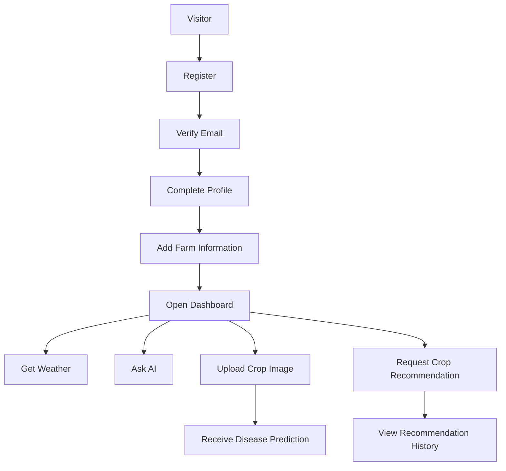
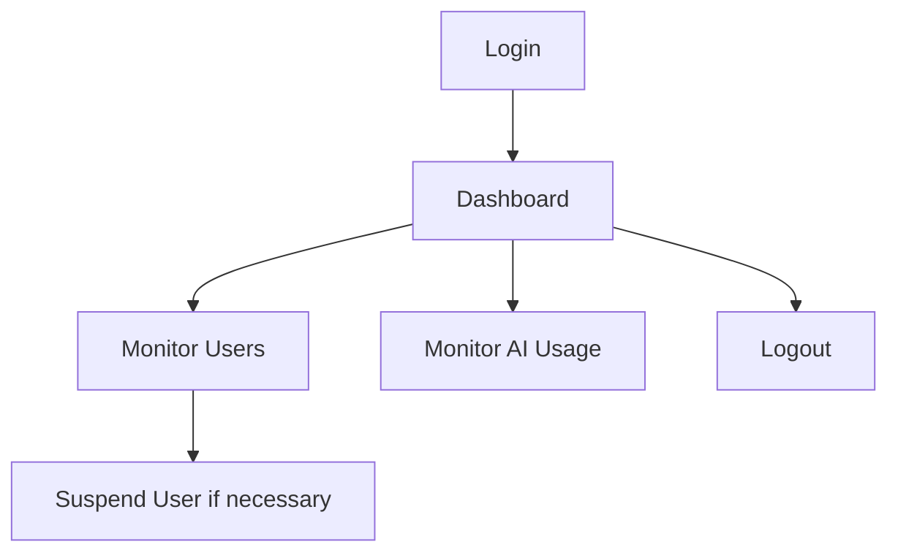

# Software Requirements Specification (SRS)

Version: 1.0.0

---

# 1. Introduction

## 1.1 Purpose

This Software Requirements Specification (SRS) defines the functional and non-functional requirements for the AgriSmart backend system.

The purpose of this document is to provide a clear understanding of the product's objectives, business requirements, user needs, system behavior, and project scope before implementation begins.

This document serves as the primary reference for developers, designers, testers, and future contributors throughout the software development lifecycle (SDLC).

## 1.2 Scope

AgriSmart is an AI-powered agriculture platform designed to help farmers make better farming decisions through intelligent recommendations and personalized insights.

The MVP focuses on providing:

- Secure user authentication
- Farmer profile management
- Farm information management
- AI crop recommendation
- Plant disease detection
- AI farming assistant
- Personalized dashboard
- Basic administration

The following features are outside the scope of Version 1:

- Marketplace
- Community Forum
- Knowledge Hub
- Billing & Subscription
- Enterprise Management

## 1.3 Product Vision

AgriSmart aims to empower farmers by providing AI-driven agricultural assistance that improves productivity, reduces crop loss, and supports data-driven farming decisions.

The platform leverages artificial intelligence to recommend suitable crops, identify plant diseases, answer agricultural questions, and maintain farming records through a simple and accessible user experience.

## 1.4 Definitions

- **Farmer**: Primary end-user of the platform.
- **AI Recommendation**: Crop recommendations generated using AI models based on environmental and farming inputs.
- **Disease Detection**: AI-based prediction of crop diseases using uploaded images.
- **Dashboard**: Personalized overview containing weather, recommendations, and farming activities.
- **MVP**: Minimum Viable Product representing the first production release.

## 1.5 Guiding Principles

- **Farmer-first design**: Every feature must solve a real farming problem.
- **Simplicity over complexity**: Prioritize ease of use over feature count.
- **AI as an assistant**: AI should assist, not replace, human decision-making.
- **Security and privacy**: Security and user privacy are first-class requirements.
- **Modularity and scalability**: The platform should be modular and scalable to support future expansion.

---

# 2. Stakeholders

## 2.1 Stakeholders

The AgriSmart platform involves multiple stakeholders who contribute to or benefit from the system.

| Stakeholder | Responsibility |
|---|---|
| Farmers | Use the platform for AI-powered farming assistance and crop management. |
| System Administrators | Manage users, monitor system health, and oversee platform operations. |
| Product Owner | Defines business goals, product requirements, and roadmap. |
| Development Team | Designs, develops, tests, and maintains the platform. |
| AI Service Provider | Provides AI-powered recommendation and conversational services. |
| Weather API Provider | Supplies weather forecast and environmental data. |

## 2.2 Target Users

The MVP primarily targets individual farmers who want AI-powered assistance for making better farming decisions.

Secondary users include system administrators responsible for platform management and monitoring.

## 2.3 User Roles

### Farmer

The primary end-user of the platform.

**Responsibilities:**

- Register an account
- Manage profile
- Manage farm information
- Request crop recommendations
- Detect plant diseases
- Chat with the AI assistant
- View dashboard

---

### Admin

Responsible for platform administration.

**Responsibilities:**

- View users
- Suspend users
- Monitor AI usage
- View platform statistics

## 2.4 User Permission

| Module | Farmer | Admin |
|---|:---:|:---:|
| Register | ✅ | ❌ |
| Login | ✅ | ✅ |
| Update Profile | ✅ (Own) | ❌ |
| Crop Recommendation | ✅ | ❌ |
| Disease Detection | ✅ | ❌ |
| AI Chat | ✅ | ❌ |
| Dashboard | ✅ | ✅ |
| View Users | ❌ | ✅ |
| Suspend User | ❌ | ✅ |

## 2.5 User Journey

### Farmer Journey

### Admin Journey

## 2.6 Stakeholder Expectations

What does each stakeholder expect from the system?

| Stakeholder | Expectation |
|---|---|
| Farmer | Easy-to-use, accurate AI recommendations, reliable disease detection, secure account |
| Admin | Efficient user management, system visibility, platform stability |
| Product Owner | Achieve business goals and deliver value to farmers |
| Development Team | Maintainable, scalable, well-documented codebase |

---

# 3. Business Requirements

## 3.1 Business Goals

The primary business goals of AgriSmart MVP are:

### BG-01: Improve Farming Decisions

Enable farmers to make more informed farming decisions through AI-powered crop recommendations and agricultural guidance.

---

### BG-02: Reduce Crop Loss

Provide early plant disease detection to help farmers identify potential issues before they become severe.

---

### BG-03: Increase Accessibility to Agricultural Knowledge

Allow farmers to ask agricultural questions through an AI assistant instead of relying solely on traditional sources.

---

### BG-04: Digitize Farming Records

Enable farmers to securely store and access their farming information, recommendations, and disease detection history.

---

### BG-05: Build a Scalable Foundation

Deliver a secure and maintainable MVP that can support future expansion, including marketplace, community, and enterprise features.

## 3.2 Success Metrics

The MVP will be considered successful if it achieves the following objectives:

### Product Metrics

- Users can successfully register and log in.
- Farmers can receive AI crop recommendations.
- Farmers can upload crop images and receive disease analysis.
- Farmers can interact with the AI assistant.
- Farmers can view their historical recommendations and disease reports.

### System Metrics

- API success rate ≥ 99%
- Average API response time < 500 ms (excluding AI processing)
- Authentication success rate ≥ 99%
- No critical security vulnerabilities in production

### User Experience Metrics

- Farmers can complete registration within 2 minutes.
- AI responses are understandable and actionable.
- Dashboard loads quickly and displays relevant information.

## 3.3 Assumptions

The following assumptions are made for the MVP:

- Farmers have access to an internet connection.
- Farmers possess smartphones or computers capable of using the web application.
- External AI services are available and operational.
- Weather API providers deliver accurate and timely weather data.
- Users provide accurate farming information for AI recommendations.
- Uploaded crop images are of sufficient quality for disease analysis.
- Email delivery services are available for account verification and password reset.

## 3.4 Constraints

The AgriSmart MVP must operate within the following constraints:

### Project Scope

- Only the features defined for the MVP are included.
- Marketplace, Community Forum, Knowledge Hub, and Billing are excluded from Version 1.

### Technical Constraints

- The backend will expose REST APIs.
- Authentication is required for all protected resources.
- AI recommendations depend on third-party AI services.
- Weather information depends on external weather providers.

### Business Constraints

- The platform is intended for individual farmers during the MVP phase.
- Only English is supported initially.
- The MVP focuses on usability and correctness over advanced feature breadth.

## 3.5 Out of Scope

The following capabilities are intentionally excluded from the MVP:

- Online marketplace
- Community forum
- Knowledge hub
- Subscription billing
- Push notifications
- Mobile applications
- Multi-language support
- Offline mode

---

# 4. Functional Requirements

## 4.1 Authentication

### 4.1.1 Purpose

The Authentication module provides secure identity management for platform users.

It enables users to create accounts, authenticate themselves, recover passwords, maintain secure sessions, and protect access to authorized resources.

### 4.1.2 Actors

- **Primary Actor**: Farmer
- **Secondary Actor**: Admin
- **System Actor**: Email Service

### 4.1.3 Functional Requirements

- **FR-AUTH-001**: The system shall allow users to register using an email address and password.
- **FR-AUTH-002**: The system shall verify that each email address is unique.
- **FR-AUTH-003**: The system shall send an email verification link after successful registration.
- **FR-AUTH-004**: The system shall allow verified users to log in.
- **FR-AUTH-005**: The system shall allow authenticated users to log out.
- **FR-AUTH-006**: The system shall allow users to reset forgotten passwords through email verification.
- **FR-AUTH-007**: The system shall issue authenticated sessions after successful login.
- **FR-AUTH-008**: The system shall invalidate active sessions after password reset.
- **FR-AUTH-009**: The system shall prevent suspended users from logging in.
- **FR-AUTH-010**: The system shall record authentication events for security auditing.

### 4.1.4 Business Rules

- Email address must be unique.
- Password must satisfy the defined password policy.
- Email verification is required before accessing protected resources.
- A suspended account cannot authenticate.
- Password reset tokens expire after a configured duration.
- Authentication events must be logged.
- Only authenticated users may access protected APIs.

### 4.1.5 Inputs

- **Registration**: Name, Email, Password, Phone, Location
- **Login**: Email, Password
- **Forgot Password**: Email
- **Reset Password**: Reset Token, New Password

### 4.1.6 Outputs

- **Successful Registration**: Account Created
- **Successful Login**: Authenticated Session
- **Successful Logout**: Session Terminated
- **Password Reset**: Password Updated
- **Email Verification**: Account Activated

### 4.1.7 Error Conditions

The system shall handle the following scenarios:

- Duplicate email address
- Invalid credentials
- Unverified account
- Suspended account
- Expired reset token
- Invalid verification token
- Too many failed login attempts
- Missing required fields

### 4.1.8 Dependencies

The Authentication module depends on:

- Email Service
- User Management Module
- Logging System
- Session Management

### 4.1.9 Future Enhancements

- Google Authentication
- Facebook Authentication
- Multi-Factor Authentication
- Device Management
- Session Dashboard
- Biometric Authentication

---

## 4.2 User Profile

### 4.2.1 Purpose

The User Profile module enables farmers to manage their personal information and farm-related data.

The module provides the system with the contextual information required to personalize AI recommendations, disease analysis, dashboard insights, and future farming records.

### 4.2.2 Actors

- **Primary Actor**: Farmer
- **Secondary Actor**: Admin

### 4.2.3 Functional Requirements

- **FR-PROF-001**: The system shall allow authenticated users to create and manage their profile.
- **FR-PROF-002**: The system shall allow users to update their personal information.
- **FR-PROF-003**: The system shall allow users to upload or update their profile image.
- **FR-PROF-004**: The system shall allow users to create and maintain farm information.
- **FR-PROF-005**: The system shall allow users to update farm information at any time.
- **FR-PROF-006**: The system shall store farming preferences for personalized recommendations.
- **FR-PROF-007**: The system shall allow users to view their complete profile information.
- **FR-PROF-008**: The system shall allow administrators to view user profiles when required for platform management.
- **FR-PROF-009**: The system shall prevent users from modifying other users' profiles.
- **FR-PROF-010**: The system shall maintain profile update history when required for auditing purposes.

### 4.2.4 Business Rules

- Users may only modify their own profile.
- Farm information must belong to exactly one user.
- Required profile fields must be completed before accessing AI recommendations.
- The system shall validate all profile information before saving.
- Suspended users cannot update profile information.
- Users may update their profile information at any time.
- Administrators may view profiles but cannot modify farmer-owned data unless explicitly authorized.

### 4.2.5 Inputs

- **Personal Information**: Full Name, Phone Number, Profile Image, Location
- **Farm Information**: Farm Name, District, Farm Size, Soil Type, Primary Crop, Farming Experience

### 4.2.6 Outputs

- **Successful Profile Creation**: Profile Created
- **Successful Profile Update**: Profile Updated
- **Successful Farm Update**: Farm Information Updated
- **Profile Retrieval**: Complete User Profile Returned

### 4.2.7 Error Conditions

The system shall handle the following scenarios:

- Unauthorized access
- Attempting to modify another user's profile
- Missing required profile fields
- Invalid farm information
- Invalid image upload
- Unsupported image format
- Suspended account attempting profile updates

### 4.2.8 Dependencies

The User Profile module depends on:

- Authentication Module
- Authorization System
- File Storage Service
- Logging System

### 4.2.9 Future Enhancements

- Multiple farms per user
- Family accounts
- Farm member invitations
- Farm ownership transfer
- GPS-based farm location
- Automatic soil data integration
- IoT sensor integration

---

## 4.3 Dashboard

### 4.3.1 Purpose

The Dashboard module provides authenticated users with a personalized overview of their farming activities, AI insights, weather information, and recent platform interactions.

The dashboard serves as the primary entry point after login by aggregating information from multiple system modules into a single view.

### 4.3.2 Actors

- **Primary Actor**: Farmer
- **Secondary Actor**: Admin

### 4.3.3 Functional Requirements

- **FR-DASH-001**: The system shall display a personalized dashboard for authenticated users.
- **FR-DASH-002**: The system shall display the current weather information based on the user's farm location.
- **FR-DASH-003**: The system shall display recent AI crop recommendations.
- **FR-DASH-004**: The system shall display recent plant disease detection results.
- **FR-DASH-005**: The system shall display recent AI conversations.
- **FR-DASH-006**: The system shall display important farming reminders when available.
- **FR-DASH-007**: The system shall provide quick access to frequently used platform features.
- **FR-DASH-008**: The system shall display personalized farming insights when available.
- **FR-DASH-009**: The system shall display appropriate empty states when dashboard data is unavailable (e.g., *"You haven't requested any crop recommendations yet."*).
- **FR-DASH-010**: The system shall ensure that users can only view dashboard information related to their own account.

### 4.3.4 Business Rules

- Dashboard information shall only contain data belonging to the authenticated user.
- Dashboard data shall represent the most recent available information.
- Weather information shall be based on the user's configured farm location.
- The dashboard shall remain accessible even if one external service is temporarily unavailable.
- Missing information shall not prevent the remaining dashboard components from loading.
- Personalized insights shall be generated using the user's available farming data.

### 4.3.5 Inputs

The dashboard uses information from:

- Authenticated User
- User Profile
- Farm Information
- Weather Service
- Crop Recommendation Module
- Disease Detection Module
- AI Assistant Module

### 4.3.6 Outputs

The dashboard provides:

- Current weather summary
- Recent crop recommendations
- Recent disease detection results
- Recent AI conversations
- Personalized farming insights
- Farming reminders
- Quick action shortcuts

### 4.3.7 Error Conditions

The system shall handle the following scenarios:

- Weather service unavailable
- AI service unavailable
- No farming data available
- Unauthorized access
- Dashboard data retrieval failure
- Partial data retrieval failure

### 4.3.8 Dependencies

The Dashboard module depends on:

- Authentication Module
- User Profile Module
- Weather Service
- Crop Recommendation Module
- Disease Detection Module
- AI Assistant Module
- Logging System

### 4.3.9 Future Enhancements

- Weekly farming reports
- Crop growth analytics
- Yield prediction
- Weather trend visualization
- Smart notifications
- Calendar integration
- IoT sensor summaries
- Marketplace recommendations

### 4.3.10 Ownership

This module owns:

- Dashboard layout
- Dashboard summary generation
- Dashboard aggregation logic

This module does NOT own:

- Weather data
- User profile data
- Disease prediction logic
- Crop recommendation logic
- AI conversation data

---

## 4.4 Crop Recommendation

### 4.4.1 Purpose

The Crop Recommendation module assists farmers in selecting suitable crops by analyzing farm-related information and generating personalized recommendations.

The module aims to improve farming decisions by providing recommendations based on the available agricultural data supplied by the user.

### 4.4.2 Actors

- **Primary Actor**: Farmer
- **Secondary Actor**: Admin (Read Only)
- **System Actor**: Recommendation Engine

### 4.4.3 Functional Requirements

- **FR-CROP-001**: The system shall allow authenticated users to request crop recommendations.
- **FR-CROP-002**: The system shall collect the required agricultural information before generating recommendations.
- **FR-CROP-003**: The system shall generate personalized crop recommendations based on the provided agricultural information.
- **FR-CROP-004**: The system shall provide an explanation describing why each crop is recommended.
- **FR-CROP-005**: The system shall allow users to view previous crop recommendations.
- **FR-CROP-006**: The system shall store recommendation history for future reference.
- **FR-CROP-007**: The system shall associate every recommendation with the authenticated user.
- **FR-CROP-008**: The system shall allow users to view the detailed information of a previous recommendation.
- **FR-CROP-009**: The system shall indicate when a recommendation cannot be generated.
- **FR-CROP-010**: The system shall allow administrators to review recommendation records for monitoring purposes.

### 4.4.4 Business Rules

- Only authenticated users may request recommendations.
- Recommendations shall be generated using the most recent information provided by the user.
- Every recommendation shall belong to exactly one user.
- Historical recommendations shall remain available unless deleted according to the data retention policy.
- The system shall record the date and time of each recommendation.
- Users may only access their own recommendation history.
- The system shall clearly indicate when sufficient information is unavailable to generate reliable recommendations.

### 4.4.5 Inputs

The recommendation process may use information including:

- Farm Information
- Soil Information
- Environmental Conditions
- Weather Information
- User Preferences
- Agricultural Inputs provided by the user

### 4.4.6 Outputs

The recommendation process returns:

- Recommended Crops
- Recommendation Explanation
- Recommendation Confidence (if available)
- Recommendation Timestamp

### 4.4.7 Error Conditions

The system shall handle the following scenarios:

- Missing required agricultural information
- Invalid agricultural information
- Recommendation generation failure
- External recommendation service unavailable
- Unauthorized access
- Recommendation retrieval failure

### 4.4.8 Dependencies

The Crop Recommendation module depends on:

- Authentication Module
- User Profile Module
- Weather Service
- Recommendation Engine
- Logging System

### 4.4.9 Future Enhancements

- Seasonal recommendations
- Multi-crop comparison
- Fertilizer recommendations
- Irrigation recommendations
- Yield prediction
- Market price integration
- Satellite data integration
- Government subsidy recommendations

### 4.4.10 Ownership

This module owns:

- Recommendation requests
- Recommendation history
- Recommendation generation workflow
- Recommendation retrieval

This module does NOT own:

- Weather forecasting
- User authentication
- User profile management
- AI model implementation
- Dashboard presentation

---

## 4.5 Disease Detection

### 4.5.1 Purpose

The Disease Detection module assists farmers in identifying potential crop diseases by analyzing uploaded crop images and generating diagnostic insights.

The module aims to support early disease identification, reduce crop loss, and provide actionable guidance for farmers.

### 4.5.2 Actors

- **Primary Actor**: Farmer
- **Secondary Actor**: Admin (Read Only)
- **System Actor**: Disease Analysis Engine

### 4.5.3 Functional Requirements

- **FR-DISEASE-001**: The system shall allow authenticated users to upload crop images for disease analysis.
- **FR-DISEASE-002**: The system shall validate uploaded images before analysis.
- **FR-DISEASE-003**: The system shall analyze uploaded images and generate disease detection results.
- **FR-DISEASE-004**: The system shall provide a diagnosis summary describing the detected disease or indicate that no disease was identified.
- **FR-DISEASE-005**: The system shall provide recommended actions based on the diagnosis when available.
- **FR-DISEASE-006**: The system shall store disease detection history for authenticated users.
- **FR-DISEASE-007**: The system shall allow users to review previous disease detection reports.
- **FR-DISEASE-008**: The system shall associate every disease detection report with the authenticated user.
- **FR-DISEASE-009**: The system shall indicate when disease analysis cannot be completed.
- **FR-DISEASE-010**: The system shall allow administrators to review disease detection records for monitoring purposes.

### 4.5.4 Business Rules

- Only authenticated users may submit images for disease analysis.
- Every disease detection report shall belong to exactly one user.
- Uploaded images shall be validated before analysis.
- The system shall preserve disease detection history unless removed according to the data retention policy.
- The system shall record the date and time of each disease analysis.
- Users may only access their own disease detection history.
- The system shall clearly indicate when an uploaded image cannot be analyzed.
- The system shall clearly communicate that AI-generated results are recommendations intended to assist users and should not replace professional agricultural advice.

### 4.5.5 Inputs

The disease detection process may use information including:

- Crop Image
- Crop Information
- Farm Information
- Environmental Conditions
- User Context

### 4.5.6 Outputs

The disease detection process returns:

- Diagnosis Result
- Diagnosis Explanation
- Recommended Actions
- Confidence Level (if available)
- Analysis Timestamp

### 4.5.7 Error Conditions

The system shall handle the following scenarios:

- No image uploaded
- Invalid image
- Unsupported image format
- Corrupted image
- Image analysis failure
- External analysis service unavailable
- Unauthorized access
- Disease report retrieval failure

### 4.5.8 Dependencies

The Disease Detection module depends on:

- Authentication Module
- User Profile Module
- Image Storage Service
- Disease Analysis Engine
- Logging System

### 4.5.9 Future Enhancements

- Video-based disease analysis
- Multi-image comparison
- Disease progression tracking
- Offline image analysis
- Automatic treatment scheduling
- Integration with agricultural experts
- Disease outbreak alerts
- Regional disease statistics

### 4.5.10 Ownership

This module owns:

- Disease analysis requests
- Disease detection reports
- Disease detection history
- Disease diagnosis workflow

This module does NOT own:

- User authentication
- User profile management
- Weather forecasting
- Dashboard presentation
- AI model implementation

---

## 4.6 AI Assistant

### 4.6.1 Purpose

The AI Assistant module provides farmers with conversational agricultural assistance through a natural language interface.

The module enables users to ask farming-related questions, receive contextual responses, and access personalized guidance based on available user and farm information.

### 4.6.2 Actors

- **Primary Actor**: Farmer
- **Secondary Actor**: Admin (Read Only)
- **System Actor**: Conversational AI Engine

### 4.6.3 Functional Requirements

- **FR-AI-001**: The system shall allow authenticated users to submit agricultural questions using natural language.
- **FR-AI-002**: The system shall generate conversational responses relevant to the submitted question.
- **FR-AI-003**: The system shall maintain conversation history for authenticated users.
- **FR-AI-004**: The system shall allow users to retrieve previous conversations.
- **FR-AI-005**: The system shall allow users to continue an existing conversation.
- **FR-AI-006**: The system shall provide personalized responses when sufficient user and farm information is available.
- **FR-AI-007**: The system shall indicate when a question cannot be answered.
- **FR-AI-008**: The system shall associate every conversation with the authenticated user.
- **FR-AI-009**: The system shall allow users to delete their conversation history.
- **FR-AI-010**: The system shall allow administrators to review AI usage statistics without accessing private conversation content unless explicitly authorized.

### 4.6.4 Business Rules

- Only authenticated users may access the AI Assistant.
- Every conversation shall belong to exactly one user.
- Users may only access their own conversation history.
- AI responses are intended to assist users and shall not replace professional agricultural advice.
- Conversation history shall be retained according to the platform's data retention policy.
- Personalized responses shall only use information the user has provided.
- The system shall indicate when it cannot generate a reliable response.
- The system shall record sufficient information about each AI interaction to support auditing, troubleshooting, and future service improvements while respecting user privacy and applicable data retention policies.

### 4.6.5 Inputs

The AI Assistant may use information including:

- User Question
- Conversation Context
- User Profile
- Farm Information
- Previous AI Conversations
- Agricultural Context

### 4.6.6 Outputs

The AI Assistant returns:

- AI Response
- Conversation Identifier
- Response Timestamp
- Related References (if available)
- Suggested Follow-up Questions (if available)

### 4.6.7 Error Conditions

The system shall handle the following scenarios:

- Empty question
- Invalid request
- Conversation not found
- AI service unavailable
- Response generation failure
- Unauthorized access
- Conversation retrieval failure

### 4.6.8 Dependencies

The AI Assistant module depends on:

- Authentication Module
- User Profile Module
- Conversational AI Engine
- Logging System

### 4.6.9 Future Enhancements

- Voice conversations
- Image-based conversations
- Multi-language support
- Personalized learning
- Offline AI assistant
- Integration with agricultural experts
- Farm task recommendations
- Weather-aware conversations

### 4.6.10 Ownership

This module owns:

- AI conversations
- Conversation history
- AI response generation workflow
- Conversation management

This module does NOT own:

- User authentication
- User profile management
- Disease detection
- Crop recommendation
- Dashboard presentation
- AI model implementation

---

## 4.7 Admin

### 4.7.1 Purpose

The Admin module enables authorized administrators to manage the platform, monitor system activity, oversee users, and maintain operational health.

The module supports platform governance without exposing or modifying farmer-owned data beyond authorized administrative responsibilities.

### 4.7.2 Actors

- **Primary Actor**: Admin
- **Secondary Actor**: System Administrator (Future)
- **System Actor**: Logging System

### 4.7.3 Functional Requirements

- **FR-ADMIN-001**: The system shall allow authorized administrators to authenticate and access the administrative dashboard.
- **FR-ADMIN-002**: The system shall allow administrators to view registered users.
- **FR-ADMIN-003**: The system shall allow administrators to search and filter users.
- **FR-ADMIN-004**: The system shall allow administrators to suspend and reactivate user accounts.
- **FR-ADMIN-005**: The system shall allow administrators to review AI usage statistics.
- **FR-ADMIN-006**: The system shall allow administrators to review platform activity logs appropriate to their authorization level.
- **FR-ADMIN-007**: The system shall allow administrators to view aggregate platform statistics (e.g., Total users, Active users, AI requests, Disease analyses, Crop recommendations).
- **FR-ADMIN-008**: The system shall record all administrative actions for auditing purposes.
- **FR-ADMIN-009**: The system shall restrict administrative functionality to authorized administrators only.
- **FR-ADMIN-010**: The system shall prevent administrators from accessing private user information unless required by an authorized administrative function.

### 4.7.4 Business Rules

- Administrative features shall only be accessible to authorized administrators.
- Every administrative action shall be auditable.
- Administrators may suspend users but shall not permanently delete user accounts during the MVP.
- Platform statistics shall represent aggregated system information.
- Administrative access shall follow the principle of least privilege.
- Administrative actions shall not expose private user information beyond authorized responsibilities.

### 4.7.5 Inputs

Administrative operations may use:

- User Identifier
- Search Criteria
- Administrative Actions
- Dashboard Filters
- Reporting Parameters

### 4.7.6 Outputs

The Admin module provides:

- User List
- Platform Statistics
- AI Usage Reports
- Administrative Activity Logs
- User Status Updates

### 4.7.7 Error Conditions

The system shall handle the following scenarios:

- Unauthorized administrative access
- Insufficient permissions
- User not found
- Administrative action failure
- Statistics retrieval failure
- Audit logging failure

### 4.7.8 Dependencies

The Admin module depends on:

- Authentication Module
- Authorization System
- User Profile Module
- Logging System
- Dashboard Module

### 4.7.9 Future Enhancements

- Role-Based Access Control (RBAC)
- Permission Management
- System Configuration
- AI Prompt Management
- Feature Flags
- Platform Announcements
- Analytics Dashboard
- Multi-Administrator Support

### 4.7.10 Ownership

This module owns:

- Administrative dashboard
- User administration
- Platform monitoring
- Administrative reporting
- Administrative auditing

This module does NOT own:

- User authentication
- User profile data
- Crop recommendations
- Disease detection
- AI conversations
- Business logic of other modules

---

# 5. Non-Functional Requirements

## 5.1 Security

The system shall protect user accounts, personal information, and platform resources from unauthorized access, misuse, and common security threats.

### 5.1.1 Security Requirements

- **NFR-SEC-001**: The system shall require authentication for all protected resources.
- **NFR-SEC-002**: The system shall enforce authorization based on user roles and permissions.
- **NFR-SEC-003**: The system shall protect sensitive user information during storage and transmission.
- **NFR-SEC-004**: The system shall securely manage user credentials.
- **NFR-SEC-005**: The system shall protect against common web security threats.
- **NFR-SEC-006**: The system shall record security-related events for auditing purposes.
- **NFR-SEC-007**: The system shall prevent unauthorized access to administrative resources.

## 5.2 Performance

- **NFR-PERF-001**: The system shall provide responsive API operations under expected workload.
- **NFR-PERF-002**: The system shall minimize unnecessary database operations.
- **NFR-PERF-003**: The system shall support efficient retrieval of user data.
- **NFR-PERF-004**: The system shall optimize resource usage for AI requests whenever possible.
- **NFR-PERF-005**: The system shall continue to provide acceptable performance as data volume increases.

## 5.3 Scalability

- **NFR-SCALE-001**: The system shall support future growth in users, farms, and AI requests.
- **NFR-SCALE-002**: The system architecture shall allow new modules to be added with minimal impact on existing modules.
- **NFR-SCALE-003**: The platform shall support horizontal scaling where appropriate.
- **NFR-SCALE-004**: The system shall minimize tight coupling between business modules.

## 5.4 Reliability

- **NFR-REL-001**: The system shall preserve user data integrity.
- **NFR-REL-002**: The system shall recover gracefully from recoverable failures.
- **NFR-REL-003**: The system shall avoid data corruption during unexpected failures.
- **NFR-REL-004**: The system shall continue operating when non-critical external services become temporarily unavailable whenever possible.

## 5.5 Availability

- **NFR-AVA-001**: The platform should be available whenever users require access.
- **NFR-AVA-002**: Planned maintenance shall minimize service disruption.
- **NFR-AVA-003**: Critical failures shall be detected promptly.
- **NFR-AVA-004**: External service failures shall not unnecessarily interrupt unrelated platform functionality.

## 5.6 Maintainability

- **NFR-MAIN-001**: The system shall follow a modular architecture.
- **NFR-MAIN-002**: The codebase shall be organized to support long-term maintenance.
- **NFR-MAIN-003**: The system shall promote separation of concerns.
- **NFR-MAIN-004**: The project shall include sufficient documentation for future contributors.
- **NFR-MAIN-005**: The system shall support automated testing.

## 5.7 Logging

- **NFR-LOG-001**: The system shall record significant application events.
- **NFR-LOG-002**: The system shall record authentication events.
- **NFR-LOG-003**: The system shall record administrative actions.
- **NFR-LOG-004**: The system shall support troubleshooting through structured logs.
- **NFR-LOG-005**: Sensitive information shall not be written to application logs (never log passwords, tokens, OTPs, or API keys).

## 5.8 Monitoring

- **NFR-MON-001**: The system shall provide visibility into application health.
- **NFR-MON-002**: The system shall expose operational metrics for monitoring.
- **NFR-MON-003**: The system shall detect abnormal system behavior.
- **NFR-MON-004**: The system shall monitor external service availability.
- **NFR-MON-005**: The system shall support alerting for critical failures.

---

# 6. External Integrations

## 6.1 Purpose

AgriSmart integrates with external services to provide capabilities that are outside the responsibility of the core platform.

These integrations enhance the platform by providing AI-powered assistance, weather information, email delivery, and other supporting services.

## 6.2 External Services

| Integration | Purpose | Required for MVP |
|---|---|:---:|
| AI Service | Generate crop recommendations, disease analysis, and conversational responses | Yes |
| Weather Service | Provide weather information for farmers | Yes |
| Email Service | Send account verification and password reset emails | Yes |
| File Storage Service | Store profile images and crop images | Yes |

## 6.3 Integration Requirements

- **NFR-INT-001**: The system shall communicate securely with external services.
- **NFR-INT-002**: The system shall handle external service failures gracefully.
- **NFR-INT-003**: The system shall validate responses received from external services before using them.
- **NFR-INT-004**: The system shall log integration failures for troubleshooting and monitoring.
- **NFR-INT-005**: The system shall avoid exposing sensitive credentials or secrets during external communication.

## 6.4 Failure Handling

The platform shall continue operating whenever possible if an external service becomes temporarily unavailable.

Examples include:

- **AI service unavailable**: Return an appropriate error without affecting authentication or profile management.
- **Weather service unavailable**: Display the dashboard without weather information.
- **Email service unavailable**: Notify the user that email delivery is temporarily unavailable and allow retry when appropriate.
- **File storage unavailable**: Reject the upload request without affecting unrelated platform functionality.

## 6.5 Future Integrations

Potential future integrations include:

- SMS Notification Service
- Push Notification Service
- Payment Gateway
- Agricultural Market Price API
- Government Agriculture Services
- Satellite Imagery Services
- IoT Sensor Platforms
- GIS Mapping Services

## 6.6 Integration Ownership

The platform is responsible for:

- Preparing valid requests
- Authenticating with external services
- Validating responses
- Handling failures gracefully
- Logging integration events

The platform is not responsible for:

- External service availability
- External service accuracy
- Third-party pricing or quotas
- Changes made by external providers

---

# 7. Risks

## 7.1 Technical Risks

| Risk | Impact | Mitigation |
|---|---|---|
| AI service becomes unavailable | High | Handle failures gracefully and allow retry when appropriate. |
| Weather service outage | Medium | Continue serving the dashboard without weather information. |
| External API changes | Medium | Isolate integrations behind service abstractions. |
| Poor AI response quality | High | Clearly communicate that AI provides assistance and not professional advice. |
| Large image uploads | Medium | Validate uploads and enforce upload limits. |

## 7.2 Security Risks

| Risk | Impact | Mitigation |
|---|---|---|
| Unauthorized access | High | Enforce authentication and authorization. |
| Data leakage | High | Protect sensitive information and avoid exposing private user data. |
| Credential compromise | High | Securely manage user credentials and secrets. |
| Abuse of AI services | Medium | Monitor usage and apply appropriate usage limits. |

## 7.3 Operational Risks

| Risk | Impact | Mitigation |
|---|---|---|
| Service downtime | High | Monitor system health and recover from failures promptly. |
| Logging failures | Medium | Ensure critical operational events remain observable. |
| Increasing user growth | Medium | Design the architecture to support future scaling. |

## 7.4 Business Risks

| Risk | Impact | Mitigation |
|---|---|---|
| Low user adoption | High | Focus on solving real farming problems and gather user feedback. |
| Incorrect recommendations | High | Provide explanations and encourage users to seek professional advice when appropriate. |
| Scope creep | Medium | Restrict the MVP to the approved project scope. |

---

# 8. Future Scope

## 8.1 Vision

Following a successful MVP, AgriSmart aims to evolve into a comprehensive digital farming platform that assists farmers throughout the entire agricultural lifecycle, from planning and cultivation to harvesting and post-harvest decision making.

## 8.2 Planned Enhancements

### Phase 2

- Multiple farms per user
- Advanced farmer dashboard
- Smart farming reminders
- Multi-language support
- Voice-enabled AI Assistant
- Rich recommendation history

### Phase 3

- Marketplace
- Community forum
- Agricultural knowledge hub
- Crop calendar
- Farm activity tracking
- Government agriculture integration

### Phase 4

- IoT sensor integration
- Satellite imagery analysis
- Yield prediction
- Pest outbreak forecasting
- Smart irrigation recommendations
- Fertilizer optimization

### Phase 5

- Enterprise farm management
- Cooperative management
- Mobile application
- Offline synchronization
- AI-powered business analytics
- Predictive farming insights

## 8.3 Long-Term Goals

The long-term vision of AgriSmart includes:

- Becoming an intelligent digital farming assistant.
- Supporting farmers with personalized, data-driven insights.
- Integrating multiple agricultural data sources into a unified platform.
- Providing scalable services for both individual farmers and agricultural organizations.

---

# 9. Requirements Traceability Matrix

| Business Goal | Functional Requirement | Module |
|---|---|---|
| BG-01 Improve Farming Decisions | FR-CROP-001 to FR-CROP-010 | Crop Recommendation |
| BG-01 Improve Farming Decisions | FR-DASH-001 to FR-DASH-010 | Dashboard |
| BG-02 Reduce Crop Loss | FR-DISEASE-001 to FR-DISEASE-010 | Disease Detection |
| BG-03 Increase Accessibility | FR-AI-001 to FR-AI-010 | AI Assistant |
| BG-04 Digitize Farming Records | FR-PROF-001 to FR-PROF-010 | User Profile |
| BG-04 Digitize Farming Records | FR-AUTH-001 to FR-AUTH-010 | Authentication |
| BG-05 Build a Scalable Foundation | FR-ADMIN-001 to FR-ADMIN-010 | Admin |
| BG-05 Build a Scalable Foundation | All NFRs | Entire System |