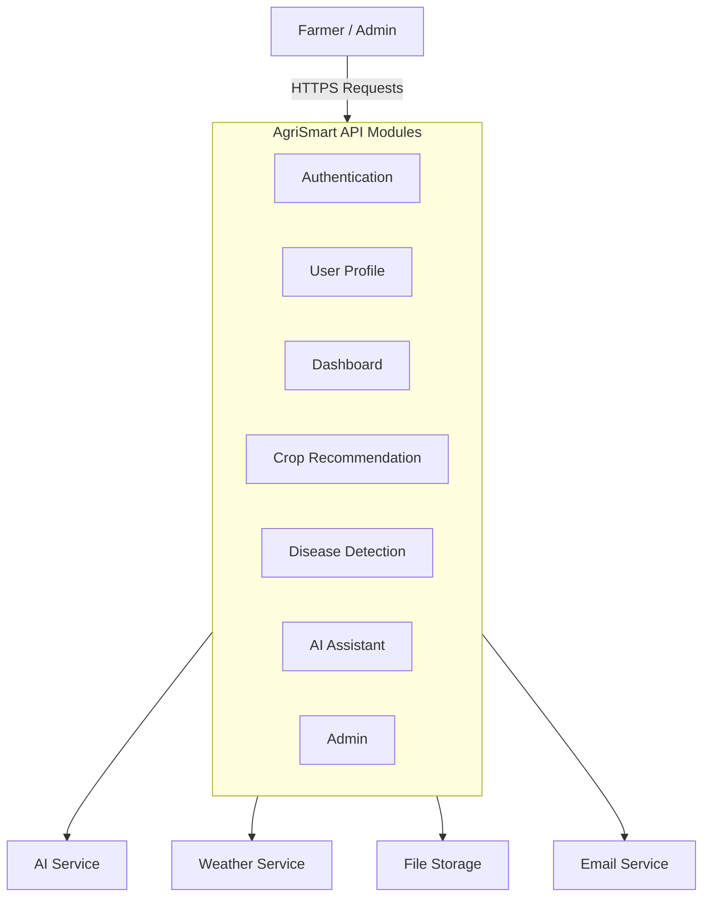
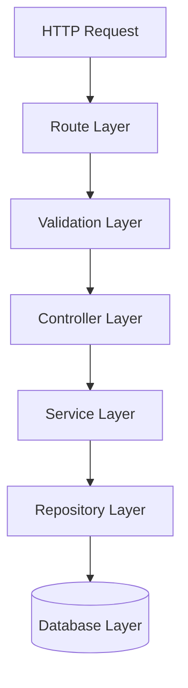
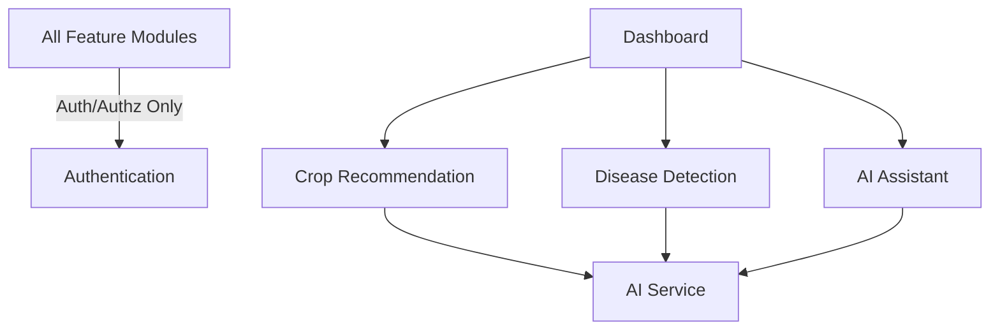
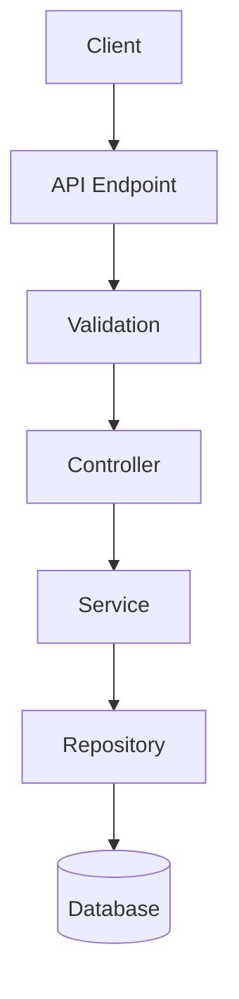
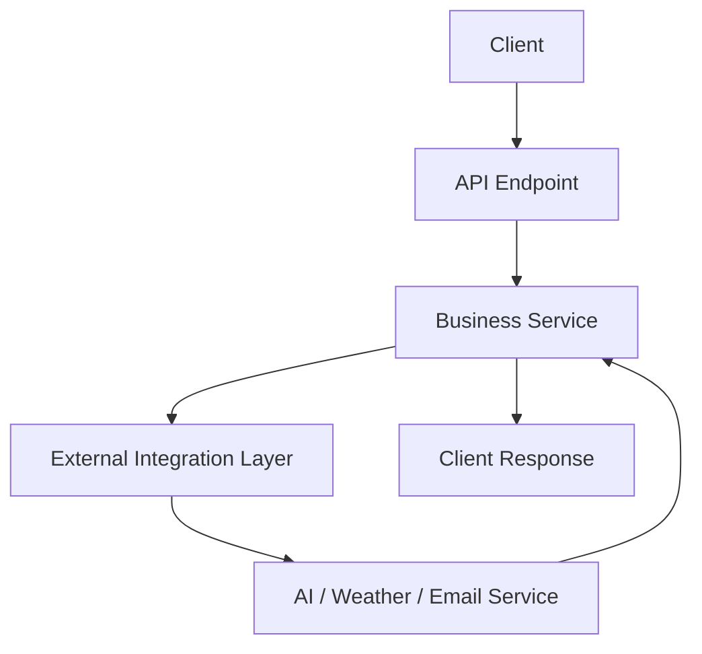
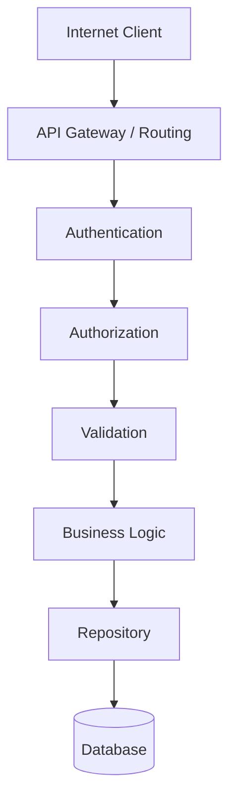
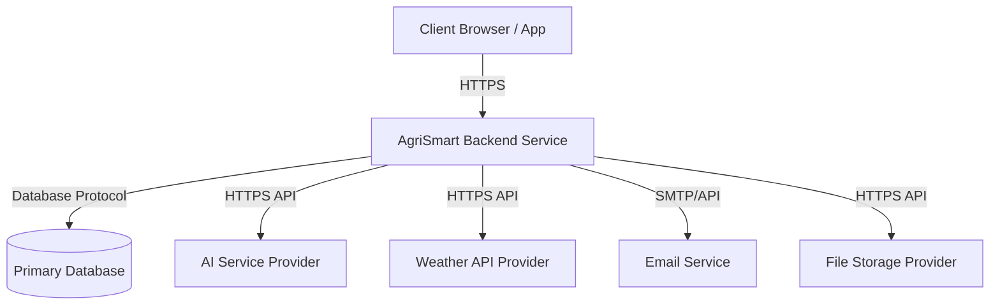

# Architecture Specification

Version: 1.0.0

---

# 1. Architecture Overview

## 1.1 Purpose

This document describes the high-level architecture of the AgriSmart backend system.

Its purpose is to define how the system is organized, how components interact, and which architectural principles guide implementation.

The architecture aims to support maintainability, scalability, security, and long-term evolution while satisfying the requirements defined in the Software Requirements Specification (SRS).

## 1.2 Architecture Goals

The backend architecture is designed to achieve the following goals:

- Maintain a clear separation of responsibilities.
- Support modular feature development.
- Promote testability and maintainability.
- Enable future scalability without major redesign.
- Isolate external service integrations.
- Protect user data through secure design.
- Minimize coupling between business domains.
- Maximize code readability and developer productivity.

## 1.3 Architecture Principles

### AP-001: Modular Design

Each business capability shall be implemented as an independent module with clearly defined responsibilities.

---

### AP-002: Separation of Concerns

Business logic, transport logic, persistence, and infrastructure concerns shall remain separated.

---

### AP-003: Single Responsibility

Each component should have one primary responsibility.

---

### AP-004: Dependency Direction

Business logic shall not depend directly on external services or frameworks.

---

### AP-005: Explicit Ownership

Every module shall clearly own its data, business rules, and workflows.

---

### AP-006: Technology Independence

Business rules should not depend on implementation technologies.

---

### AP-007: Fail Gracefully

Failures in external services should not unnecessarily interrupt unrelated platform functionality.

---

### AP-008: Security by Design

Security shall be considered during architecture and implementation rather than added afterward.

---

### AP-009: Observability

The architecture shall support logging, monitoring, and troubleshooting.

---

### AP-010: Evolutionary Architecture

The architecture should support incremental growth without requiring large-scale rewrites.

## 1.4 Architectural Constraints

The MVP backend will be developed under the following constraints:

- Expose functionality through REST APIs.
- Use a modular monolith architecture for Version 1.
- Maintain a single deployable backend application.
- Persist application data in a single primary database.
- Integrate with external services through well-defined abstraction layers.
- Support stateless application instances where practical.

---

# 2. System Context

## 2.1 External Actors

- **Farmer**: The primary user of the platform who manages farming activities, requests AI-powered recommendations, detects crop diseases, and interacts with the AI Assistant.
- **Administrator**: An authorized platform operator responsible for monitoring system activity, managing users, and maintaining operational health.
- **External Service Providers**: Third-party systems that provide specialized capabilities such as AI processing, weather information, email delivery, and file storage.

## 2.2 External Systems

| External System | Responsibility |
|---|---|
| AI Service | Generate AI-powered recommendations, disease analysis, and conversational responses |
| Weather Service | Provide weather information |
| Email Service | Deliver account verification and password reset emails |
| File Storage Service | Store uploaded crop images and user profile images |

## 2.3 System Boundary



**The AgriSmart backend is responsible for:**

- Authentication and authorization
- User profile management
- Dashboard aggregation
- Crop recommendation workflow
- Disease detection workflow
- AI conversation management
- Administrative operations
- Business rules
- Data persistence
- API responses

**The AgriSmart backend is NOT responsible for:**

- AI model implementation
- Weather forecasting
- Email delivery infrastructure
- File storage infrastructure
- External authentication providers

## 2.4 Module Ownership

| Module | Owns |
|---|---|
| Authentication | Identity, authentication, authorization |
| User Profile | Farmer profile and farm information |
| Dashboard | Aggregated dashboard view |
| Crop Recommendation | Recommendation requests and history |
| Disease Detection | Disease reports and history |
| AI Assistant | Conversations and chat history |
| Admin | Platform administration and operational reporting |

---

# 3. High-Level Architecture

## 3.1 Architecture Style

AgriSmart Version 1 follows a **Modular Monolith Architecture**.

The application is deployed as a single backend service while organizing business capabilities into independent modules with clearly defined responsibilities.

Each module encapsulates its own business logic, routes, services, validation, and data access.

Modules communicate through well-defined interfaces rather than directly accessing each other's internal implementation.

This architecture provides:

- Simplicity for MVP development
- Strong separation of business domains
- Easier testing and maintenance
- Clear ownership of business logic
- A migration path toward microservices if future scaling requires it

## 3.2 Layers



The backend is organized into logical layers with clearly defined responsibilities:

- **Route Layer**: Responsible for defining API endpoints and connecting requests to controllers.
- **Validation Layer**: Responsible for validating incoming requests before business processing begins.
- **Controller Layer**: Responsible for handling HTTP requests and responses. Controllers coordinate application flow but do not contain business logic.
- **Service Layer**: Responsible for implementing business rules and coordinating workflows. Most application logic resides in this layer.
- **Repository Layer**: Responsible for data persistence and retrieval. Repositories abstract database operations from business logic.
- **Database Layer**: Responsible for permanently storing application data.

## 3.3 Modules

The backend is organized into the following business modules:

- **Authentication**: Responsible for authentication, authorization, and identity management.
- **User Profile**: Responsible for user profiles and farm information.
- **Dashboard**: Responsible for aggregating information from multiple business modules into a unified dashboard.
- **Crop Recommendation**: Responsible for recommendation requests, recommendation history, and recommendation workflows.
- **Disease Detection**: Responsible for disease analysis requests, diagnosis reports, and detection history.
- **AI Assistant**: Responsible for conversational AI interactions and conversation history.
- **Admin**: Responsible for platform administration, operational reporting, and user management.

## 3.4 Module Ownership

| Module | Owns | Does Not Own |
|---|---|---|
| Authentication | Identity, authentication, authorization | User profile, AI features |
| User Profile | Farmer profile, farm information | Authentication, AI workflows |
| Dashboard | Dashboard aggregation | Business data from other modules |
| Crop Recommendation | Recommendation workflow and history | Weather forecasting, AI provider |
| Disease Detection | Disease reports and history | Image storage infrastructure |
| AI Assistant | Conversations and chat history | Recommendation logic, disease analysis |
| Admin | Platform operations and reporting | Business logic of feature modules |

## 3.5 Module Dependency Rules

The following architectural rules shall be followed:

- Modules shall not access another module's database models directly.
- Modules shall communicate through services or well-defined interfaces.
- Business logic shall remain inside the owning module.
- Shared utilities shall not contain business logic.
- Cross-module dependencies shall be minimized.
- Circular dependencies between modules are prohibited.
- Infrastructure concerns shall remain separate from business modules.

---

# 4. Request Lifecycle

## 4.1 Purpose

This section describes how HTTP requests are processed within the AgriSmart backend.

The request lifecycle defines the sequence of processing stages that every request follows, ensuring consistency, security, validation, and separation of responsibilities across the application.

## 4.2 Request Processing Flow

Every incoming request follows the same high-level processing sequence:

1. Request Reception
2. Global Middleware Execution
3. Authentication (when required)
4. Authorization (when required)
5. Request Validation
6. Controller Execution
7. Business Logic Processing
8. Data Access
9. Response Generation
10. Response Delivery

## 4.3 Lifecycle Stages

### Stage 1 — Request Reception
The backend receives an HTTP request through the appropriate API endpoint. The routing layer determines which module and controller should process the request.

### Stage 2 — Global Middleware
Application-wide middleware performs common processing such as request parsing, security-related middleware, request logging, and other cross-cutting concerns before business processing begins.

### Stage 3 — Authentication
Protected endpoints verify the identity of the requesting user. Requests that fail authentication are rejected before reaching business logic.

### Stage 4 — Authorization
The system verifies whether the authenticated user has permission to perform the requested operation. Unauthorized requests are rejected immediately.

### Stage 5 — Request Validation
Incoming request data is validated against the expected contract. Invalid requests are rejected with appropriate validation errors before reaching business logic.

### Stage 6 — Controller
Controllers coordinate request processing. Responsibilities include:

- Receiving validated input
- Calling the appropriate service
- Returning standardized responses

*Controllers shall not contain business logic.*

### Stage 7 — Business Logic
The service layer executes the application's business rules and coordinates workflows. Services may interact with multiple repositories and external integrations while enforcing business policies.

### Stage 8 — Data Access
Repositories handle all interactions with persistent storage. Business services remain independent of database implementation details.

### Stage 9 — Response Generation
The controller prepares a standardized API response based on the service result. Application errors are converted into consistent error responses.

### Stage 10 — Response Delivery
The backend returns the final HTTP response to the client. The response includes the appropriate status code, response body, and any required headers.

## 4.4 Error Flow

Errors may occur during any stage of request processing.

When an error occurs:

- Further request processing stops.
- The error is handled by the centralized error handling mechanism.
- A standardized error response is returned to the client.
- The error is logged when appropriate.

## 4.5 External Integration Flow

When a request requires an external service:

1. The service prepares the integration request.
2. The external service processes the request.
3. The response is validated.
4. Business logic processes the result.
5. The final response is returned to the client.

External integration failures shall be handled without unnecessarily affecting unrelated application functionality.

## 4.6 Cross-Cutting Pipeline Rules

The following rules apply to every request:

- Every request shall produce a standardized API response.
- Validation shall occur before business logic execution.
- Authentication shall occur before authorization.
- Business logic shall not access HTTP request or response objects directly.
- Database access shall occur through repositories only.
- Errors shall be handled by a centralized error handling mechanism.
- Every request shall be traceable through application logs using a request identifier.

---

# 5. Component Design

## 5.1 Standard Module Structure

All business modules in AgriSmart follow a consistent internal architecture.

Each module encapsulates its own routing, validation, business logic, persistence, and related components while exposing only well-defined interfaces to other modules.

```text
module/
├── routes/
├── validation/
├── controller/
├── service/
├── repository/
├── model/
├── interfaces/
├── constants/
├── utils/
└── index.ts
```

## 5.2 Internal Component Responsibilities

- **Routes**: Define API endpoints, apply middleware, and forward requests to controllers.
- **Validation**: Validate incoming requests and reject invalid input before business processing.
- **Controller**: Coordinate request processing, call services, and return standardized responses (shall not contain business logic).
- **Service**: Implement business rules, coordinate workflows, interact with repositories, and communicate with external integrations.
- **Repository**: Encapsulate data persistence, hide database implementation details, and provide reusable data access methods.
- **Model**: Represent persistent application entities.
- **Interfaces**: Define contracts between components.
- **Constants**: Store module-specific constant values.
- **Utilities**: Contain helper functions without business logic.

## 5.3 Authentication

- **Responsibilities**: User registration, user authentication, token management, password management, email verification, authorization support.
- **Collaborates With**: User Profile, Email Service.
- **Owns**: Authentication workflows, authentication tokens, identity verification.
- **Does Not Own**: User profile data, dashboard, AI features.

## 5.4 User Profile

- **Responsibilities**: Farmer profile, farm information, account settings.
- **Collaborates With**: Authentication, Dashboard.
- **Owns**: Profile information, farm information.
- **Does Not Own**: Authentication, AI workflows.

## 5.5 Dashboard

- **Responsibilities**: Aggregate information, build dashboard responses, provide summary information.
- **Collaborates With**: User Profile, Crop Recommendation, Disease Detection, AI Assistant, Weather Service.
- **Owns**: Dashboard composition.
- **Does Not Own**: Business data from other modules.

## 5.6 Crop Recommendation

- **Responsibilities**: Recommendation workflow, recommendation history, recommendation generation.
- **Collaborates With**: User Profile, Weather Service, AI Service.
- **Owns**: Recommendation requests, recommendation history.
- **Does Not Own**: Weather forecasting, AI implementation.

## 5.7 Disease Detection

- **Responsibilities**: Disease analysis workflow, disease reports, detection history.
- **Collaborates With**: File Storage, AI Service.
- **Owns**: Disease reports, detection history.
- **Does Not Own**: Image storage, AI implementation.

## 5.8 AI Assistant

- **Responsibilities**: Conversations, conversation history, AI interaction workflow.
- **Collaborates With**: User Profile, AI Service.
- **Owns**: Conversations, chat history.
- **Does Not Own**: Crop recommendations, disease detection.

## 5.9 Admin

- **Responsibilities**: Platform administration, operational reporting, user administration.
- **Collaborates With**: Authentication, Dashboard, Logging System.
- **Owns**: Administrative workflows, administrative reports.
- **Does Not Own**: Business logic of feature modules.

## 5.10 Allowed Dependencies



---

# 6. Cross-Cutting Concerns

## 6.1 Authentication

Authentication verifies the identity of the requesting user before protected resources are accessed.

### Architectural Principles

- Protected endpoints shall require authentication.
- Public endpoints shall explicitly declare that authentication is not required.
- Authentication shall occur before authorization.
- Business services shall assume authenticated user information has already been verified.
- Authentication logic shall remain centralized and reusable.

## 6.2 Authorization

Authorization determines whether an authenticated user has permission to perform a requested action.

### Architectural Principles

- Authorization shall occur after successful authentication.
- Access decisions shall follow the principle of least privilege.
- Authorization rules shall be centralized.
- Business modules shall not duplicate authorization logic.
- Administrative operations shall require elevated permissions.

## 6.3 Validation

Validation ensures that incoming requests satisfy the expected contract before business logic executes.

### Architectural Principles

- Every externally supplied input shall be validated.
- Validation shall occur before controller execution.
- Invalid requests shall not reach the service layer.
- Validation rules shall be defined close to the API contract.
- Validation errors shall follow a standardized response format.

## 6.4 Error Handling

Errors shall be handled through a centralized error handling mechanism.

### Architectural Principles

- Business components shall report errors rather than formatting HTTP responses.
- Unhandled errors shall be converted into standardized API responses.
- Error responses shall avoid exposing internal implementation details.
- Recoverable and non-recoverable failures shall be handled consistently.
- Error handling shall support application logging and monitoring.

## 6.5 Logging

Logging provides visibility into application behavior for troubleshooting, auditing, and operational monitoring.

### Architectural Principles

- Significant application events shall be logged.
- Authentication and administrative events shall be logged.
- Sensitive information shall never be written to logs.
- Log entries shall support request tracing.
- Logging shall remain independent of business logic.

## 6.6 Configuration

Application behavior shall be configurable without modifying business logic.

### Architectural Principles

- Environment-specific configuration shall be externalized.
- Sensitive configuration values shall be managed securely.
- Business modules shall not contain environment-specific logic.
- Configuration shall remain centralized and reusable.

## 6.7 Caching

Caching may be introduced to improve performance for suitable read-heavy operations.

### Architectural Principles

- Caching shall be transparent to business logic where practical.
- Cached data shall remain consistent with application requirements.
- Cache failures shall not prevent the application from functioning.
- Cache invalidation strategies shall be defined before implementation.

## 6.8 Rate Limiting

Rate limiting protects the platform from abuse while ensuring fair resource usage.

### Architectural Principles

- Public endpoints may apply stricter request limits.
- AI-powered operations may have independent usage limits.
- Administrative operations may use separate rate limiting policies.
- Rate limiting decisions shall remain configurable.

## 6.9 Standard Response Model

Every endpoint should return responses in a consistent format.

```json
// Success Response Structure
{
  "success": true,
  "message": "Operation completed successfully",
  "data": {},
  "metadata": {}
}

// Error Response Structure
{
  "success": false,
  "message": "Error description",
  "errors": [],
  "traceId": "req-12345"
}
```

---

# 7. Data Flow

## 7.1 Purpose

This section describes how information flows through the AgriSmart backend, from client requests to persistent storage and external services.

The objective is to ensure that data movement remains predictable, secure, and consistent across all business modules.

## 7.2 Internal Data Flow



## 7.3 External Data Flow



## 7.4 Data Ownership Principles

- Every business entity shall have a single owning module.
- Modules shall not modify another module's data directly.
- Shared data shall be accessed through the owning module.
- Data consistency shall be maintained through business workflows.

## 7.5 Data Lifecycle

Application data generally follows the following lifecycle:

1. Request received
2. Validation
3. Business processing
4. Persistence
5. Retrieval
6. Response generation
7. Logging and monitoring

---

# 8. Security Architecture

## 8.1 Security Principles

The architecture follows a defense-in-depth approach by applying multiple layers of protection throughout the request lifecycle.

Security responsibilities are distributed across authentication, authorization, validation, secure configuration, and operational monitoring.

## 8.2 Security Layers



## 8.3 Sensitive Data

Sensitive information shall receive additional protection throughout its lifecycle.

Examples include:

- User credentials
- Authentication tokens
- Personal profile information
- Administrative operations
- Application secrets

## 8.4 Security Practices

- Least privilege
- Secure defaults
- Defense in depth
- Fail securely
- Input validation
- Auditability

---

# 9. Scalability Strategy

## 9.1 Scaling Strategy

The MVP backend is designed as a modular monolith that can scale vertically and evolve toward distributed services if future business requirements justify the additional complexity.

## 9.2 Growth Strategy

The architecture supports growth by:

- Adding new business modules
- Increasing infrastructure capacity
- Isolating external integrations
- Optimizing database access
- Introducing caching where appropriate

## 9.3 Future Evolution

Potential future architectural evolution includes:

- Event-driven communication
- Background job processing
- Distributed caching
- Read replicas
- Independent deployment of selected modules

---

# 10. Deployment View

## 10.1 Deployment Overview

AgriSmart Version 1 is deployed as a single backend application exposing REST APIs.

Supporting infrastructure includes persistent storage and external integration services.

## 10.2 Deployment Diagram



## 10.3 Deployment Principles

- Single deployable backend application
- Stateless application instances where practical
- Centralized configuration
- Externalized infrastructure services
- Environment-specific deployment configuration

---

# 11. Architecture Decisions

| ADR ID | Architectural Decision |
|---|---|
| ADR-001 | Use a Modular Monolith architecture for Version 1. |
| ADR-002 | Organize code by business modules. |
| ADR-003 | Apply layered architecture within each module. |
| ADR-004 | Use repositories to isolate data access. |
| ADR-005 | Standardize request processing through a common lifecycle. |
| ADR-006 | Isolate third-party integrations behind dedicated services. |
| ADR-007 | Centralize cross-cutting concerns. |
| ADR-008 | Standardize API responses and centralized error handling. |
| ADR-009 | Maintain one-way module dependencies and prohibit circular dependencies. |
| ADR-010 | Keep business logic independent of infrastructure implementations. |

---

# 12. Open Questions

The following architectural topics remain open for implementation planning:

- Which database technology will be selected?
- Which ORM or ODM will be used?
- Which authentication mechanism will be implemented?
- Which validation library will be adopted?
- Which logging framework will be used?
- Which caching technology will be selected?
- Which file storage provider will be used?
- Which AI provider(s) will be integrated?
- Which weather provider will be integrated?
- Which deployment platform will host the application?