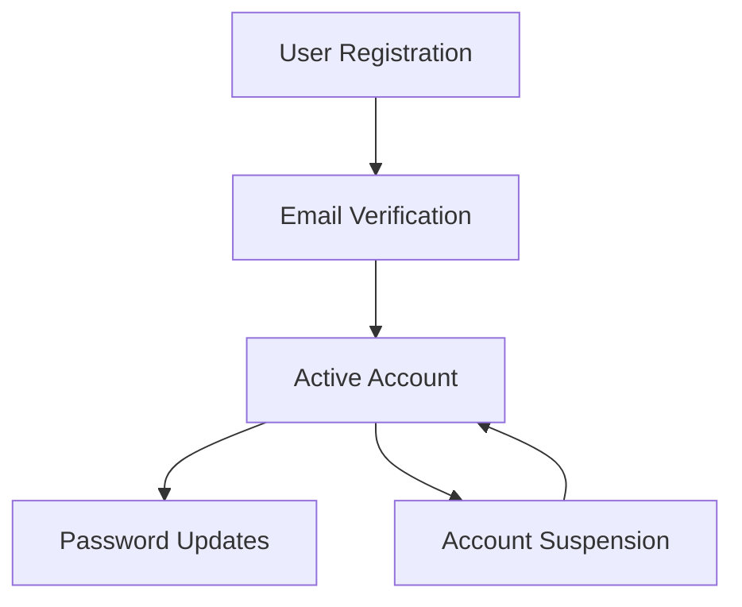
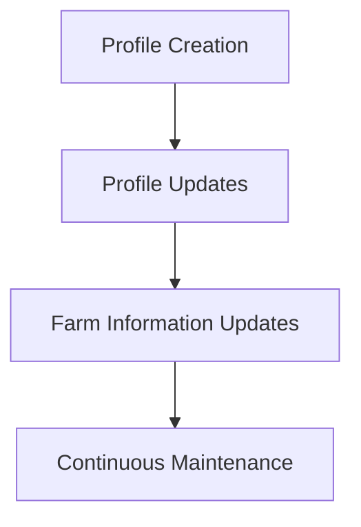
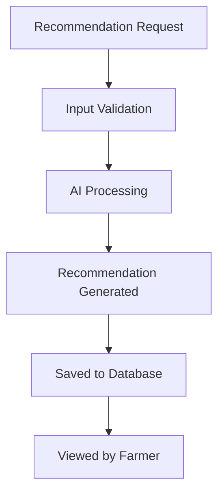
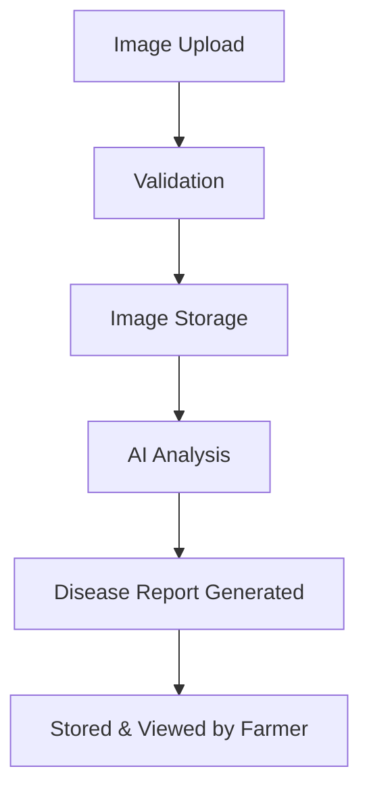
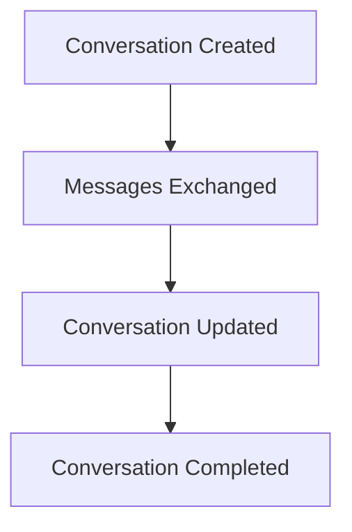
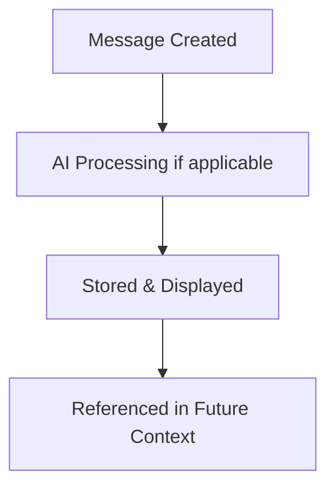
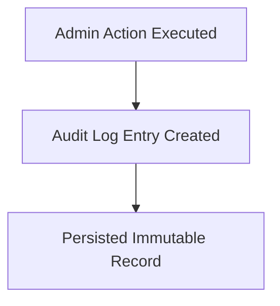
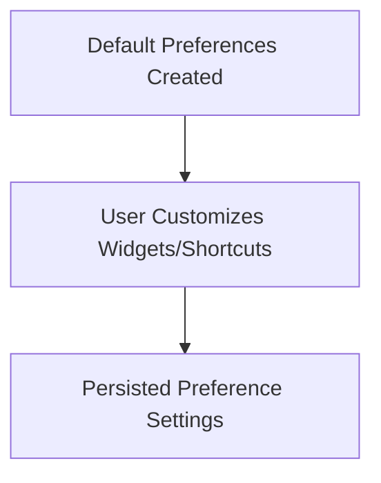
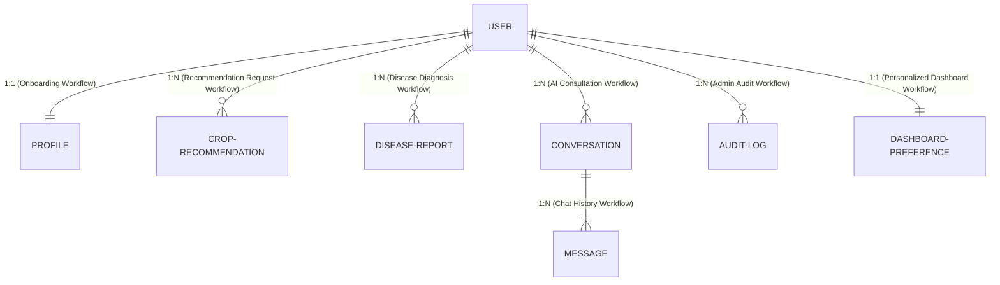

# Database Design Specification

Version: 1.0.0

---

# 1. Purpose

This document defines the logical data model for the AgriSmart backend.

It describes the business entities, their responsibilities, relationships, integrity rules, and lifecycle without depending on a specific database technology.

The goal is to ensure that application data remains consistent, maintainable, and aligned with the system architecture and requirements.

---

# 2. Database Principles

The AgriSmart data model follows these principles:

- **DP-001 Single Ownership**: Each business entity shall be owned by exactly one business module.
- **DP-002 Explicit Relationships**: Relationships between entities shall be clearly defined and justified by business workflows.
- **DP-003 Data Integrity**: Business rules shall preserve data consistency throughout the system.
- **DP-004 Auditability**: Business entities shall support auditing through lifecycle metadata where appropriate.
- **DP-005 Technology Independence**: The logical data model shall remain independent of database implementation technologies.
- **DP-006 Minimal Duplication**: Duplicate business data shall be minimized unless justified by performance or reporting requirements.
- **DP-007 Evolution**: The data model shall support future extension without requiring destructive redesign.

---

# 3. Entity Overview & SRS Traceability

Every module in the system architecture (`02-Architecture.md`) owns at least one entity, and every entity directly supports at least one functional requirement from `01-SRS.md`.

| Entity | Owning Module (Architecture) | Supported SRS Requirements | Business Purpose |
|---|---|---|---|
| User | Authentication | FR-AUTH-001 – FR-AUTH-010 | Stores account credentials, identity, and status. |
| Profile | User Profile | FR-PROF-001 – FR-PROF-010 | Stores farmer personal information and farm details. |
| Crop Recommendation | Crop Recommendation | FR-CROP-001 – FR-CROP-010 | Stores crop recommendation requests and AI results. |
| Disease Report | Disease Detection | FR-DISEASE-001 – FR-DISEASE-010 | Stores plant disease diagnostic requests and reports. |
| Conversation | AI Assistant | FR-AI-001 – FR-AI-010 | Groups AI assistant chat sessions for a user. |
| Message | AI Assistant | FR-AI-001 – FR-AI-010 | Stores individual chat messages within a conversation. |
| Audit Log | Admin | FR-ADMIN-008, FR-ADMIN-010 | Records administrative actions for system governance. |
| Dashboard Preference | Dashboard | FR-DASH-001 – FR-DASH-010 | Stores user dashboard configuration and quick shortcuts. |

---

# 4. Entity Design

## 4.1 User Entity

### 4.1.1 Purpose
Represents an authenticated user of the AgriSmart platform. The User entity is responsible for identity, authentication, and account status. It does not contain farmer-specific profile information.

### 4.1.2 Owner Module
Authentication

### 4.1.3 Lifecycle

### 4.1.4 Relationships
A User:
- owns exactly one Profile
- may create many Crop Recommendations
- may create many Disease Reports
- may own many Conversations
- may have many Audit Logs (as actor/target)
- owns exactly one Dashboard Preference

### 4.1.5 Business Rules
- Every user shall have a unique identity.
- Authentication information belongs only to the User entity.
- Profile information shall not be stored inside the User entity.
- User identity shall remain stable throughout the account lifecycle.
- Administrative status shall be managed independently of profile information.

### 4.1.6 Attributes
| Attribute | Description |
|---|---|
| Identifier | Unique system identifier |
| Email Address | Primary login identity |
| Password Credential | Authentication credential |
| Account Status | Current account state |
| Email Verification Status | Indicates whether the email has been verified |
| Role | User authorization role |
| Creation Timestamp | Account creation time |
| Last Update Timestamp | Most recent modification time |

### 4.1.7 Future Extensions
- Multi-factor authentication
- Multiple authentication providers
- Account recovery improvements
- Device management
- Login history

---

## 4.2 Profile Entity

### 4.2.1 Purpose
Represents the farmer's personal information and farm-related details. The Profile entity stores business information required by AgriSmart features while remaining independent of authentication.

### 4.2.2 Owner Module
User Profile

### 4.2.3 Lifecycle

### 4.2.4 Relationships
A Profile:
- belongs to exactly one User
- may be referenced by Crop Recommendations
- may be referenced by Disease Reports
- may provide context for AI conversations

### 4.2.5 Business Rules
- Every Profile shall belong to exactly one User.
- Profile information shall be editable by the owning user.
- Farm information shall remain independent of authentication.
- Business modules shall reference the Profile rather than duplicating farmer information.

### 4.2.6 Attributes
| Attribute | Description |
|---|---|
| Profile Identifier | Unique profile identifier |
| User Reference | Associated authenticated user |
| Full Name | Farmer name |
| Phone Number | Contact number |
| Location | Farmer location |
| Farm Information | Farm-related information |
| Profile Image | Farmer profile image |
| Creation Timestamp | Creation time |
| Last Update Timestamp | Most recent update |

### 4.2.7 Future Extensions
- Multiple farms
- Farm teams
- Farm ownership history
- Regional preferences
- Language preferences

---

## 4.3 Crop Recommendation Entity

### 4.3.1 Purpose
Represents a crop recommendation request submitted by a farmer and the resulting recommendation generated by the platform. The entity maintains the complete recommendation history.

### 4.3.2 Owner Module
Crop Recommendation

### 4.3.3 Lifecycle

### 4.3.4 Relationships
A Crop Recommendation:
- belongs to exactly one User
- references one Profile
- may use weather information from an external service
- may use an AI service to generate recommendations

### 4.3.5 Business Rules
- Every recommendation shall belong to one authenticated user.
- Recommendation requests shall be preserved for historical reference.
- Recommendations shall be generated from validated input.
- Recommendation history shall remain available to the owning user.
- External AI responses shall be stored only after successful processing.

### 4.3.6 Attributes
| Attribute | Description |
|---|---|
| Recommendation Identifier | Unique recommendation identifier |
| User Reference | Farmer requesting the recommendation |
| Profile Reference | Farmer profile used for context |
| Input Parameters | Agricultural information provided by the farmer |
| Recommendation Result | Generated recommendation |
| Processing Status | Current recommendation state |
| Request Timestamp | Time recommendation was requested |
| Completion Timestamp | Time recommendation completed |

### 4.3.7 Future Extensions
- Recommendation feedback
- Recommendation ratings
- Seasonal recommendation history
- Recommendation analytics
- Recommendation comparison

---

## 4.4 Disease Report Entity

### 4.4.1 Purpose
Represents the result of a disease analysis performed on a crop image submitted by a farmer. The entity preserves diagnostic history, recommendations, and supporting information.

### 4.4.2 Owner Module
Disease Detection

### 4.4.3 Lifecycle

### 4.4.4 Relationships
A Disease Report:
- belongs to exactly one User
- references one Profile
- references one uploaded crop image
- may use an external AI service for diagnosis

### 4.4.5 Business Rules
- Every disease report shall belong to one authenticated user.
- Disease reports shall preserve diagnostic history.
- Uploaded images shall remain associated with the generated report.
- AI-generated diagnoses shall be stored only after successful analysis.
- Historical reports shall remain accessible to the owning user.

### 4.4.6 Attributes
| Attribute | Description |
|---|---|
| Report Identifier | Unique report identifier |
| User Reference | Farmer requesting analysis |
| Profile Reference | Associated farmer profile |
| Image Reference | Uploaded crop image |
| Diagnosis Result | Disease analysis result |
| Confidence Level | Confidence of the diagnosis |
| Suggested Actions | Recommended treatment or next steps |
| Processing Status | Current analysis status |
| Request Timestamp | Analysis request time |
| Completion Timestamp | Analysis completion time |

### 4.4.7 Future Extensions
- Multiple image analysis
- Disease progression tracking
- Treatment follow-up
- Expert review workflow
- Community reporting

---

## 4.5 Conversation Entity

### 4.5.1 Purpose
Represents a conversation session between a farmer and the AgriSmart AI Assistant.

### 4.5.2 Owner Module
AI Assistant

### 4.5.3 Lifecycle

### 4.5.4 Relationships
A Conversation:
- belongs to exactly one User
- may reference one Profile for contextual information
- contains one or more Messages
- may use an external AI service to generate responses

### 4.5.5 Business Rules
- Every conversation shall belong to one authenticated user.
- A conversation shall contain one or more messages.
- Messages shall remain associated with their parent conversation.
- Conversation history shall remain accessible to the owning user.
- Conversations may be continued across multiple sessions.

### 4.5.6 Attributes
| Attribute | Description |
|---|---|
| Conversation Identifier | Unique conversation identifier |
| User Reference | Owner of the conversation |
| Profile Reference | Contextual farmer profile |
| Conversation Title | Human-readable conversation title |
| Current Status | Active or completed conversation state |
| Last Activity Timestamp | Most recent interaction time |
| Creation Timestamp | Conversation creation time |
| Last Update Timestamp | Most recent modification time |

### 4.5.7 Future Extensions
- Conversation categories
- Pinned conversations
- Conversation sharing
- AI memory management
- Conversation export
- Conversation summarization

---

## 4.6 Message Entity

### 4.6.1 Purpose
Represents an individual message exchanged within an AI conversation.

### 4.6.2 Owner Module
AI Assistant

### 4.6.3 Lifecycle

### 4.6.4 Relationships
A Message:
- belongs to exactly one Conversation
- belongs indirectly to one User through its parent Conversation
- may reference an external AI response

### 4.6.5 Business Rules
- Every message shall belong to exactly one conversation.
- Messages shall preserve chronological order within a conversation.
- User messages and AI messages shall be distinguishable.
- Messages shall not exist independently of a conversation.
- Historical messages shall remain immutable once stored.

### 4.6.6 Attributes
| Attribute | Description |
|---|---|
| Message Identifier | Unique message identifier |
| Conversation Reference | Parent conversation |
| Sender Type | User or AI Assistant |
| Message Content | Text exchanged during the conversation |
| Processing Status | Message generation state |
| Creation Timestamp | Time the message was created |

### 4.6.7 Future Extensions
- Message reactions
- Message attachments
- Voice messages
- Image-based conversations
- Message translation
- AI citation support

---

## 4.7 Audit Log Entity

### 4.7.1 Purpose
Represents a record of administrative or governance actions performed on the platform.

### 4.7.2 Owner Module
Admin

### 4.7.3 Lifecycle

### 4.7.4 Relationships
An Audit Log:
- belongs to an Admin user (actor)
- references a Target User or resource

### 4.7.5 Business Rules
- Audit records shall be immutable once written.
- Every administrative action (e.g. user suspension) shall create an audit log.

### 4.7.6 Attributes
| Attribute | Description |
|---|---|
| Log Identifier | Unique audit record ID |
| Admin Reference | Identifier of admin who performed action |
| Target Reference | Identifier of user/resource affected |
| Action Type | Description of administrative action |
| Timestamp | Time action was executed |

---

## 4.8 Dashboard Preference Entity

### 4.8.1 Purpose
Represents user layout settings, shortcuts, and reminder preferences for the personalized dashboard.

### 4.8.2 Owner Module
Dashboard

### 4.8.3 Lifecycle

### 4.8.4 Relationships
A Dashboard Preference:
- belongs to exactly one User

### 4.8.5 Business Rules
- Created automatically upon user registration.
- Customizes quick action shortcuts and alert display preferences.

### 4.8.6 Attributes
| Attribute | Description |
|---|---|
| Preference Identifier | Unique preference identifier |
| User Reference | Owning user |
| Layout Settings | Display preferences and shortcuts |
| Last Update Timestamp | Time preferences were modified |

---

## 4.9 Processing State Summary

The following business entities support processing workflows:

- Crop Recommendation
- Disease Report
- AI Message (when awaiting AI generation)

**Common processing states:** `Pending`, `Processing`, `Completed`, `Failed`.

---

# 5. Relationships & Business Workflow Justifications

## 5.1 Relationship Principles

- Every relationship shall have a clearly defined owner.
- Relationship cardinality shall be explicitly documented.
- Relationships shall be justified by specific business workflows.
- Entities shall reference related entities without duplicating business information.
- Deletion behavior shall preserve data integrity.

## 5.2 Entity Relationship Diagram (Logical)

## 5.3 Relationship Definitions & Workflow Justifications

### User ↔ Profile
- **Cardinality**: One-to-One (1:1)
- **Owner**: Profile
- **Justifying Business Workflow**: Farmer Onboarding Workflow (Registration $\rightarrow$ Profile completion).
- **Business Rule**: Every authenticated user shall have exactly one profile.
- **Deletion Rule**: A profile cannot exist without its associated user.

### User ↔ Crop Recommendation
- **Cardinality**: One-to-Many (1:N)
- **Owner**: Crop Recommendation
- **Justifying Business Workflow**: Crop Recommendation Request Workflow.
- **Business Rule**: A user may create multiple crop recommendations. Every recommendation belongs to one user.
- **Deletion Rule**: Historical recommendations follow the data retention policy.

### User ↔ Disease Report
- **Cardinality**: One-to-Many (1:N)
- **Owner**: Disease Report
- **Justifying Business Workflow**: Plant Disease Detection & Diagnostic Workflow.
- **Business Rule**: A user may submit multiple disease analysis requests. Every report belongs to one user.
- **Deletion Rule**: Historical reports follow the data retention policy.

### User ↔ Conversation
- **Cardinality**: One-to-Many (1:N)
- **Owner**: Conversation
- **Justifying Business Workflow**: AI Assistant Chat Session Workflow.
- **Business Rule**: A user may maintain multiple AI conversations. Every conversation belongs to one user.

### Conversation ↔ Message
- **Cardinality**: One-to-Many (1:N)
- **Owner**: Message
- **Justifying Business Workflow**: Sequential Chat Message Exchange Workflow.
- **Business Rule**: Every conversation contains one or more messages in chronological order.
- **Deletion Rule**: Messages cannot exist independently of their parent conversation.

### User ↔ Audit Log
- **Cardinality**: One-to-Many (1:N)
- **Owner**: Audit Log
- **Justifying Business Workflow**: Admin Audit & Platform Governance Workflow.
- **Business Rule**: Admin actions (such as user suspension) generate audit logs referencing the target user.

### User ↔ Dashboard Preference
- **Cardinality**: One-to-One (1:1)
- **Owner**: Dashboard Preference
- **Justifying Business Workflow**: Personalized Dashboard Aggregation Workflow.
- **Business Rule**: Customizes shortcut widgets and preferences for the user's dashboard view.

## 5.4 Relationship Summary Table

| Parent Entity | Child Entity | Cardinality | Owner | Justifying Business Workflow |
|---|---|:---:|---|---|
| User | Profile | 1 : 1 | Profile | Farmer Onboarding & Profile Setup |
| User | Crop Recommendation | 1 : N | Crop Recommendation | Crop Recommendation Request History |
| User | Disease Report | 1 : N | Disease Report | Plant Disease Diagnostic History |
| User | Conversation | 1 : N | Conversation | AI Assistant Session Management |
| Conversation | Message | 1 : N | Message | Chat Message Exchange History |
| User | Audit Log | 1 : N | Audit Log | Admin Platform Governance Auditing |
| User | Dashboard Preference | 1 : 1 | Dashboard Preference | Personalized Dashboard Customization |

## 5.5 Referential Integrity Rules

- Referenced users shall exist before dependent entities are created.
- Profiles shall not exist without a valid user.
- Messages shall not exist without a valid conversation.
- Dependent entities shall not reference invalid or deleted parent entities.
- Relationship validation shall occur within the service layer before persistence.

---

# 6. Indexing Strategy

## 6.1 Purpose

This section defines the logical indexing strategy for the AgriSmart data model to support common business queries and optimize database performance.

## 6.2 Primary Query Patterns & Index Candidates

- **User**: Index on `Identifier`, `Email Address` (Unique), `Account Status`.
- **Profile**: Unique Index on `User Reference`.
- **Crop Recommendation**: Indexes on `User Reference`, `Request Timestamp`, `Processing Status`, Composite `(User Reference + Request Timestamp)`.
- **Disease Report**: Indexes on `User Reference`, `Request Timestamp`, `Processing Status`, Composite `(User Reference + Request Timestamp)`.
- **Conversation**: Indexes on `User Reference`, `Last Activity Timestamp`, Composite `(User Reference + Last Activity Timestamp)`.
- **Message**: Indexes on `Conversation Reference`, `Creation Timestamp`, Composite `(Conversation Reference + Creation Timestamp)`.
- **Audit Log**: Indexes on `Admin Reference`, `Target Reference`, `Timestamp`.
- **Dashboard Preference**: Unique Index on `User Reference`.

## 6.3 Unique Constraints

The following business attributes shall remain unique across the system:

- User Identifier
- Email Address
- Profile User Reference
- Dashboard Preference User Reference

---

# 7. Data Integrity Rules

## 7.1 Entity Integrity Rules

- **User**: Every user shall have a unique email address. Credentials remain associated with one user.
- **Profile**: Belongs to exactly one user; cannot exist independently.
- **Crop Recommendation**: Belongs to an existing user; preserves historical parameters.
- **Disease Report**: Belongs to an existing user; uploaded image references remain associated with report.
- **Conversation**: Belongs to an existing user.
- **Message**: Belongs to an existing conversation; maintains chronological order.
- **Audit Log**: Immutable once written; records administrative actions.
- **Dashboard Preference**: Unique per user.

## 7.2 Business Integrity Rules

- Authentication precedes access to protected resources.
- AI-generated results are stored only after successful processing.
- Historical records remain available according to data retention policies.
- Invalid state transitions are prevented.

---

# 8. Audit Fields & Metadata

## 8.1 Standard Audit Fields

| Audit Field | Purpose |
|---|---|
| Creation Timestamp | Records when the entity was created |
| Last Update Timestamp | Records the most recent modification |
| Created By | Identifies the creator of the entity |
| Updated By | Identifies the most recent modifier |

## 8.2 Entity-Specific Audit Requirements

- **User**: Track account creation and status changes.
- **Profile**: Track profile modifications.
- **Crop Recommendation**: Track request and completion times.
- **Disease Report**: Track request and diagnosis completion times.
- **Conversation**: Track creation time and last activity.
- **Message**: Track message creation time.
- **Audit Log**: Immutable timestamp and admin actor details.

---

# 9. Soft Delete Strategy

## 9.1 Entity Policy

| Entity | Soft Delete Support | Policy Details |
|---|:---:|---|
| User | Yes | Preserves account history for audit |
| Profile | Yes | Soft-deleted alongside User account |
| Crop Recommendation | Optional | Retained for analytics according to retention policy |
| Disease Report | Optional | Retained for analytics according to retention policy |
| Conversation | Yes | Preserves conversation history |
| Message | No | Inherited from Conversation soft-delete state |
| Audit Log | No | Strictly immutable log |
| Dashboard Preference | Yes | Soft-deleted alongside User account |

---

# 10. Future Database Evolution

## 10.1 Planned Evolution

- Support for multiple farms per user.
- Enhanced crop and soil management entities.
- Weather history persistence.
- AI model interaction history.
- Notification and alert entities.
- Activity history and audit logs.