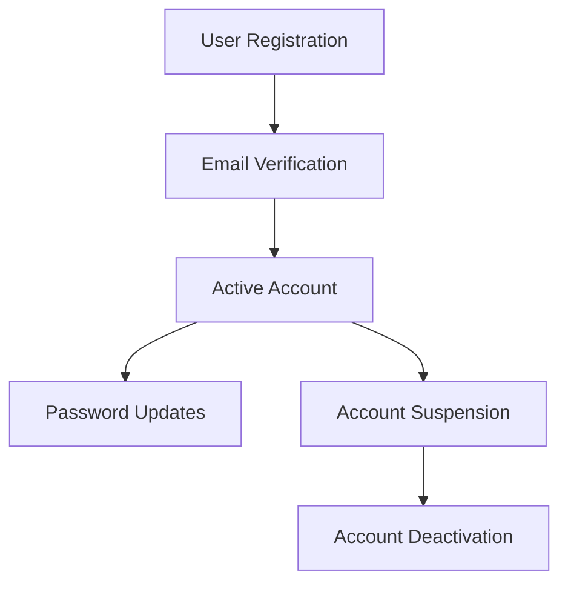
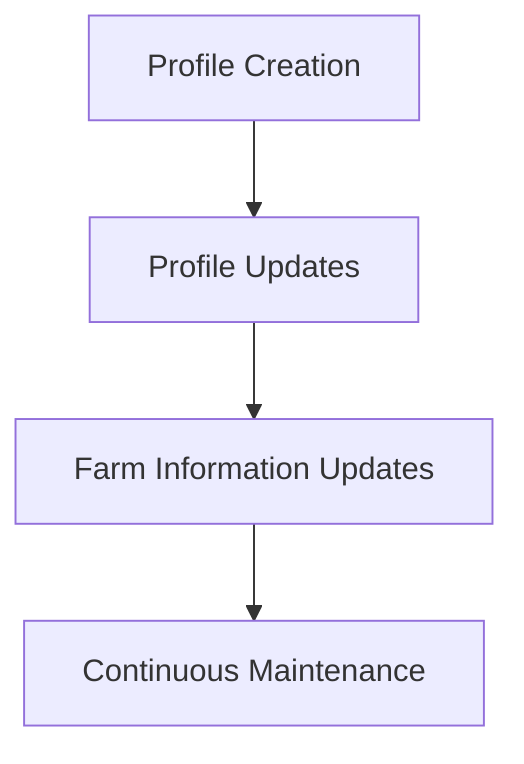
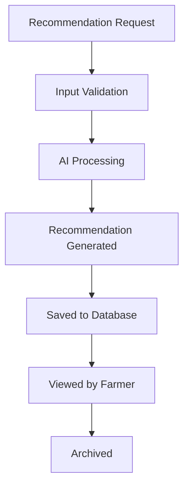
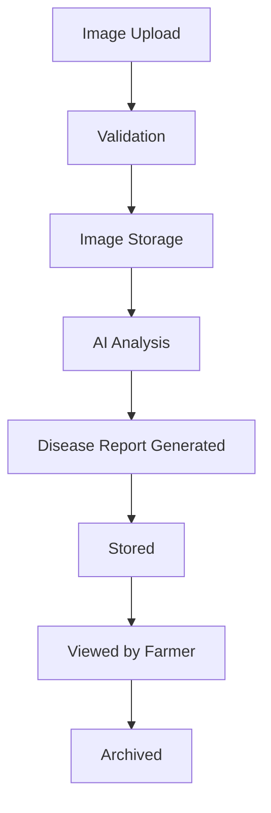
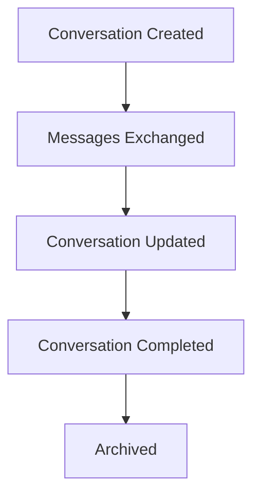
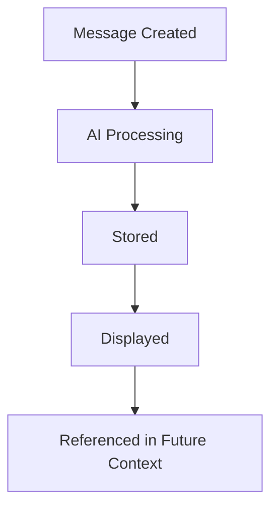
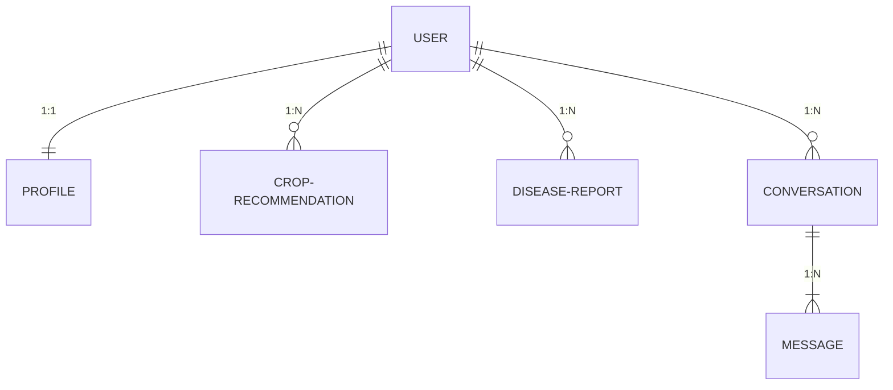

# 03-Database-Design.md

# 1. Purpose

This document defines the logical data model for the AgriSmart backend.

It describes the business entities, their responsibilities, relationships, integrity rules, and lifecycle without depending on a specific database technology.

The goal is to ensure that application data remains consistent, maintainable, and aligned with the system architecture.

# 2. Database Principles

The AgriSmart data model follows these principles:

## DP-001 Single Ownership

Each business entity shall be owned by exactly one business module.

---

## DP-002 Explicit Relationships

Relationships between entities shall be clearly defined.

---

## DP-003 Data Integrity

Business rules shall preserve data consistency throughout the system.

---

## DP-004 Auditability

Business entities shall support auditing through lifecycle metadata where appropriate.

---

## DP-005 Technology Independence

The logical data model shall remain independent of database implementation technologies.

---

## DP-006 Minimal Duplication

Duplicate business data shall be minimized unless justified by performance or reporting requirements.

---

## DP-007 Evolution

The data model shall support future extension without requiring destructive redesign.

# 3. Entity Overview

| Entity | Owning Module | Purpose |
|---------|---------------|----------|
| User | Authentication | Represents an authenticated platform user. |
| Profile | User Profile | Stores farmer profile and farm information. |
| Crop Recommendation | Crop Recommendation | Stores recommendation requests and results. |
| Disease Report | Disease Detection | Stores disease analysis requests and results. |
| Conversation | AI Assistant | Represents an AI conversation session. |
| Message | AI Assistant | Represents individual messages within a conversation. |

# 4. Entity Design

## 4.1 User Entity

### 4.1.1 Purpose

Represents an authenticated user of the AgriSmart platform.

The User entity is responsible for identity, authentication, and account status.

It does not contain farmer-specific profile information.

### 4.1.2 Owner Module

Authentication

### 4.1.3 Lifecycle

### 4.1.4 Relationships

A User:

- owns exactly one Profile
- may create many Crop Recommendations
- may create many Disease Reports
- may own many Conversations

### 4.1.5 Business Rules

- Every user shall have a unique identity.

- Authentication information belongs only to the User entity.

- Profile information shall not be stored inside the User entity.

- User identity shall remain stable throughout the account lifecycle.

- Administrative status shall be managed independently of profile information.

### 4.1.6 Attributes

| Attribute | Description |
|-----------|-------------|
| Identifier | Unique system identifier |
| Email Address | Primary login identity |
| Password Credential | Authentication credential |
| Account Status | Current account state |
| Email Verification Status | Indicates whether the email has been verified |
| Role | User authorization role |
| Creation Timestamp | Account creation time |
| Last Update Timestamp | Most recent modification time |

### 4.1.7 Future Extensions

- Multi-factor authentication
- Multiple authentication providers
- Account recovery improvements
- Device management
- Login history

## 4.2 Profile Entity

### 4.2.1 Purpose

Represents the farmer's personal information and farm-related details.

The Profile entity stores business information required by AgriSmart features while remaining independent of authentication.

### 4.2.2 Owner Module

User Profile

### 4.2.3 Lifecycle

### 4.2.4 Relationships

A Profile:

- belongs to exactly one User

- may be referenced by Crop Recommendations

- may be referenced by Disease Reports

- may provide context for AI conversations

### 4.2.5 Business Rules

- Every Profile shall belong to exactly one User.

- Profile information shall be editable by the owning user.

- Farm information shall remain independent of authentication.

- Business modules shall reference the Profile rather than duplicating farmer information.

### 4.2.6 Attributes

| Attribute | Description |
|-----------|-------------|
| Profile Identifier | Unique profile identifier |
| User Reference | Associated authenticated user |
| Full Name | Farmer name |
| Phone Number | Contact number |
| Location | Farmer location |
| Farm Information | Farm-related information |
| Profile Image | Farmer profile image |
| Creation Timestamp | Creation time |
| Last Update Timestamp | Most recent update |

### 4.2.7 Future Extensions

- Multiple farms
- Farm teams
- Farm ownership history
- Regional preferences
- Language preferences

## 4.3 Crop Recommendation Entity

### 4.3.1 Purpose

Represents a crop recommendation request submitted by a farmer and the resulting recommendation generated by the platform.

The entity maintains the complete recommendation history, allowing users to review previous recommendations and enabling future analysis.

### 4.3.2 Owner Module

Crop Recommendation

### 4.3.3 Lifecycle

### 4.3.4 Relationships

A Crop Recommendation:

- belongs to exactly one User
- references one Profile
- may use weather information from an external service
- may use an AI service to generate recommendations

### 4.3.5 Business Rules

- Every recommendation shall belong to one authenticated user.
- Recommendation requests shall be preserved for historical reference.
- Recommendations shall be generated from validated input.
- Recommendation history shall remain available to the owning user.
- External AI responses shall be stored only after successful processing.

### 4.3.6 Attributes

| Attribute | Description |
|-----------|-------------|
| Recommendation Identifier | Unique recommendation identifier |
| User Reference | Farmer requesting the recommendation |
| Profile Reference | Farmer profile used for context |
| Input Parameters | Agricultural information provided by the farmer |
| Recommendation Result | Generated recommendation |
| Processing Status | Current recommendation state |
| Request Timestamp | Time recommendation was requested |
| Completion Timestamp | Time recommendation completed |

### 4.3.7 Future Extensions

- Recommendation feedback
- Recommendation ratings
- Seasonal recommendation history
- Recommendation analytics
- Recommendation comparison

## 4.4 Disease Report Entity

### 4.4.1 Purpose

Represents the result of a disease analysis performed on a crop image submitted by a farmer.

The entity preserves diagnostic history, recommendations, and supporting information for future reference.

### 4.4.2 Owner Module

Disease Detection

### 4.4.3 Lifecycle

### 4.4.4 Relationships

A Disease Report:

- belongs to exactly one User
- references one Profile
- references one uploaded crop image
- may use an external AI service for diagnosis

### 4.4.5 Business Rules

- Every disease report shall belong to one authenticated user.
- Disease reports shall preserve diagnostic history.
- Uploaded images shall remain associated with the generated report.
- AI-generated diagnoses shall be stored only after successful analysis.
- Historical reports shall remain accessible to the owning user.

### 4.4.6 Attributes

| Attribute | Description |
|-----------|-------------|
| Report Identifier | Unique report identifier |
| User Reference | Farmer requesting analysis |
| Profile Reference | Associated farmer profile |
| Image Reference | Uploaded crop image |
| Diagnosis Result | Disease analysis result |
| Confidence Level | Confidence of the diagnosis |
| Suggested Actions | Recommended treatment or next steps |
| Processing Status | Current analysis status |
| Request Timestamp | Analysis request time |
| Completion Timestamp | Analysis completion time |

### 4.4.7 Future Extensions

- Multiple image analysis
- Disease progression tracking
- Treatment follow-up
- Expert review workflow
- Community reporting

## 4.5 Conversation Entity

### 4.5.1 Purpose

Represents a conversation session between a farmer and the AgriSmart AI Assistant.

The Conversation entity groups related messages into a single interaction history while maintaining contextual continuity for AI-powered assistance.

### 4.5.2 Owner Module

AI Assistant

### 4.5.3 Lifecycle

### 4.5.4 Relationships

A Conversation:

- belongs to exactly one User
- may reference one Profile for contextual information
- contains one or more Messages
- may use an external AI service to generate responses

### 4.5.5 Business Rules

- Every conversation shall belong to one authenticated user.
- A conversation shall contain one or more messages.
- Messages shall remain associated with their parent conversation.
- Conversation history shall remain accessible to the owning user.
- Conversations may be continued across multiple sessions.

### 4.5.6 Attributes

| Attribute | Description |
|-----------|-------------|
| Conversation Identifier | Unique conversation identifier |
| User Reference | Owner of the conversation |
| Profile Reference | Contextual farmer profile |
| Conversation Title | Human-readable conversation title |
| Current Status | Active or completed conversation state |
| Last Activity Timestamp | Most recent interaction time |
| Creation Timestamp | Conversation creation time |
| Last Update Timestamp | Most recent modification time |

### 4.5.7 Future Extensions

- Conversation categories
- Pinned conversations
- Conversation sharing
- AI memory management
- Conversation export
- Conversation summarization

## 4.6 Message Entity

### 4.6.1 Purpose

Represents an individual message exchanged within an AI conversation.

Messages capture both user inputs and AI-generated responses, preserving the chronological history of each conversation.

### 4.6.2 Owner Module

AI Assistant

### 4.6.3 Lifecycle

### 4.6.4 Relationships

A Message:

- belongs to exactly one Conversation
- belongs indirectly to one User through its parent Conversation
- may reference an external AI response

### 4.6.5 Business Rules

- Every message shall belong to exactly one conversation.
- Messages shall preserve chronological order within a conversation.
- User messages and AI messages shall be distinguishable.
- Messages shall not exist independently of a conversation.
- Historical messages shall remain immutable once stored, except where administrative moderation is required.

### 4.6.6 Attributes

| Attribute | Description |
|-----------|-------------|
| Message Identifier | Unique message identifier |
| Conversation Reference | Parent conversation |
| Sender Type | User or AI Assistant |
| Message Content | Text exchanged during the conversation |
| Processing Status | Message generation state |
| Creation Timestamp | Time the message was created |

### 4.6.7 Future Extensions

- Message reactions
- Message attachments
- Voice messages
- Image-based conversations
- Message translation
- AI citation support

## 4.7 Processing State

The following business entities support processing workflows:

- Crop Recommendation
- Disease Report
- AI Message (when awaiting AI generation)

Common processing states:

- Pending
- Processing
- Completed
- Failed

# 5. Relationships

## 5.1 Relationship Principles

The AgriSmart data model follows these relationship principles:

- Every relationship shall have a clearly defined owner.
- Relationship cardinality shall be explicitly documented.
- Relationships shall reflect business rules rather than implementation details.
- Entities shall reference related entities without duplicating business information.
- Deletion behavior shall preserve data integrity.

## 5.2 Entity Relationship Diagram (Logical)

## 5.3 Relationship Definitions

### User ↔ Profile

#### Relationship

One-to-One (1:1)

#### Owner

Profile

#### Business Rule

Every authenticated user shall have exactly one profile.

Every profile shall belong to exactly one user.

#### Deletion Rule

A profile cannot exist without its associated user.

### User ↔ Crop Recommendation

#### Relationship

One-to-Many (1:N)

#### Owner

Crop Recommendation

#### Business Rule

A user may create multiple crop recommendations.

Every crop recommendation shall belong to exactly one user.

#### Deletion Rule

Historical recommendations should remain consistent with the application's data retention policy.

### User ↔ Disease Report

#### Relationship

One-to-Many (1:N)

#### Owner

Disease Report

#### Business Rule

A user may submit multiple disease analysis requests.

Every disease report shall belong to exactly one user.

#### Deletion Rule

Historical reports should follow the application's data retention policy.

### User ↔ Conversation

#### Relationship

One-to-Many (1:N)

#### Owner

Conversation

#### Business Rule

A user may maintain multiple AI conversations.

Every conversation shall belong to exactly one user.

### Conversation ↔ Message

#### Relationship

One-to-Many (1:N)

#### Owner

Message

#### Business Rule

Every conversation shall contain one or more messages.

Every message shall belong to exactly one conversation.

Messages shall preserve chronological order.

#### Deletion Rule

Messages shall not exist independently of their parent conversation.

## 5.4 Relationship Summary

| Parent Entity | Child Entity | Cardinality | Owner |
|---------------|--------------|-------------|-------|
| User | Profile | 1 : 1 | Profile |
| User | Crop Recommendation | 1 : N | Crop Recommendation |
| User | Disease Report | 1 : N | Disease Report |
| User | Conversation | 1 : N | Conversation |
| Conversation | Message | 1 : N | Message |

## 5.5 Relationship Ownership Matrix

| Relationship | Owns the Reference | Reason |
|--------------|--------------------|--------|
| User → Profile | Profile | A profile cannot exist without a user. |
| User → Crop Recommendation | Crop Recommendation | Recommendations belong to the requesting user. |
| User → Disease Report | Disease Report | Reports belong to the requesting user. |
| User → Conversation | Conversation | Conversations belong to the requesting user. |
| Conversation → Message | Message | Messages belong to a single conversation. |

## 5.6 Referential Integrity Rules

The application shall maintain relationship integrity through business logic.

Rules include:

- Referenced users shall exist before dependent entities are created.
- Profiles shall not exist without a valid user.
- Messages shall not exist without a valid conversation.
- Dependent entities shall not reference invalid or deleted parent entities.
- Relationship validation shall occur within the service layer before persistence.

## 5.7 Relationship Navigation

The following navigation paths are supported:

- User → Profile
- User → Crop Recommendations
- User → Disease Reports
- User → Conversations
- Conversation → Messages

Reverse navigation shall be implemented only where justified by business requirements and performance considerations.

# 6. Index Strategy

## 6.1 Purpose

This section defines the logical indexing strategy for the AgriSmart data model.

Indexes are designed to support common business queries, improve application performance, and maintain efficient data retrieval while avoiding unnecessary storage and write overhead.

## 6.2 Indexing Principles

The indexing strategy follows these principles:

- Indexes shall support frequently executed queries.
- Indexes shall be justified by business use cases.
- Unique business identifiers shall be indexed.
- Composite indexes shall be introduced only when required by query patterns.
- Unused indexes shall be avoided to minimize maintenance overhead.

## 6.3 Index Candidates

### User

#### Primary Query Patterns

- Find user by email
- Find user by identifier
- Find users by account status (administration)

#### Index Candidates

- Identifier
- Email Address (Unique)
- Account Status

### Profile

#### Primary Query Patterns

- Find profile by user
- Retrieve profile information

#### Index Candidates

- User Reference (Unique)

### Crop Recommendation

#### Primary Query Patterns

- Retrieve recommendations for a user
- Retrieve recent recommendations
- Filter by processing status (administration)

#### Index Candidates

- User Reference
- Request Timestamp
- Processing Status
- Composite: (User Reference + Request Timestamp)

### Disease Report

#### Primary Query Patterns

- Retrieve reports for a user
- Retrieve recent reports
- Filter by processing status

#### Index Candidates

- User Reference
- Request Timestamp
- Processing Status
- Composite: (User Reference + Request Timestamp)

### Conversation

#### Primary Query Patterns

- Retrieve conversations for a user
- Retrieve most recently active conversations

#### Index Candidates

- User Reference
- Last Activity Timestamp
- Composite: (User Reference + Last Activity Timestamp)

### Message

#### Primary Query Patterns

- Retrieve messages for a conversation
- Retrieve conversation history in chronological order

#### Index Candidates

- Conversation Reference
- Creation Timestamp
- Composite: (Conversation Reference + Creation Timestamp)

## 6.4 Unique Constraints

The following business attributes shall remain unique across the system:

- User Identifier
- Email Address

Additional uniqueness constraints may be introduced as business requirements evolve.

## 6.5 Query Optimization Guidelines

The indexing strategy is designed to optimize the following query categories:

- Authentication lookups
- User-specific history retrieval
- Dashboard aggregation
- Administrative filtering
- Chronological ordering of historical records

Indexes shall evolve alongside application query patterns.

## 6.6 Index Review Policy

Indexes shall be periodically reviewed based on:

- Application query patterns
- Performance monitoring
- Storage overhead
- Write performance
- Business feature evolution

Unused or redundant indexes should be removed where appropriate.

## 6.7 Expected Query Patterns

Examples of common application queries include:

- Authenticate a user by email.
- Load a user's profile.
- Display the latest crop recommendations.
- Display the latest disease reports.
- Retrieve a user's conversations.
- Load messages for a selected conversation in chronological order.
- Filter administrative records by status.

# 7. Data Integrity Rules

## 7.1 Purpose

This section defines the business rules that preserve the correctness, consistency, and reliability of application data throughout its lifecycle.

Data integrity shall be enforced through application logic, validation, and persistence mechanisms.

## 7.2 Integrity Principles

The AgriSmart data model follows these integrity principles:

- Every business entity shall have a unique identifier.
- Required business data shall not be omitted.
- Relationships shall reference valid parent entities.
- Invalid or inconsistent data shall not be persisted.
- Business rules shall be enforced before data is stored.

## 7.3 Entity Integrity Rules

### User

- Every user shall have a unique email address.
- Authentication credentials shall remain associated with only one user.

---

### Profile

- Every profile shall belong to exactly one user.
- A profile shall not exist independently of a user.

---

### Crop Recommendation

- Every recommendation shall belong to an existing user.
- Recommendation requests shall preserve their historical results.

---

### Disease Report

- Every report shall belong to an existing user.
- Uploaded image references shall remain associated with the generated report.

---

### Conversation

- Every conversation shall belong to an existing user.

---

### Message

- Every message shall belong to an existing conversation.
- Messages shall maintain chronological ordering.

## 7.4 Relationship Integrity

The application shall maintain relationship consistency by ensuring:

- Parent entities exist before creating dependent entities.
- Orphaned entities are not created.
- Relationships remain valid throughout entity updates.
- Referential integrity is verified before persistence.

## 7.5 Business Integrity Rules

Business workflows shall preserve domain consistency by ensuring:

- Authentication precedes access to protected resources.
- AI-generated results are stored only after successful processing.
- Historical records remain available according to the application's data retention policy.
- Invalid state transitions are prevented.

# 8. Audit Fields

## 8.1 Purpose

Audit fields provide lifecycle metadata that supports operational monitoring, troubleshooting, reporting, and future auditing requirements.

Where appropriate, business entities shall include audit information.

## 8.2 Standard Audit Fields

The following audit fields should be available for business entities where applicable:

| Audit Field | Purpose |
|-------------|---------|
| Creation Timestamp | Records when the entity was created |
| Last Update Timestamp | Records the most recent modification |
| Created By | Identifies the creator of the entity |
| Updated By | Identifies the most recent modifier |

## 8.3 Entity-Specific Audit Requirements

### User

Track account creation and status changes.

---

### Profile

Track profile modifications.

---

### Crop Recommendation

Track request and completion times.

---

### Disease Report

Track request and diagnosis completion times.

---

### Conversation

Track creation time and last activity.

---

### Message

Track message creation time.

## 8.4 Audit Principles

- Audit information shall be generated consistently.
- Audit metadata shall not contain sensitive business information.
- Audit fields shall support operational investigations.
- Historical timestamps shall remain immutable once recorded.

# 9. Soft Delete Strategy

## 9.1 Purpose

Soft deletion allows business entities to be logically removed from active use while preserving historical data for auditing, recovery, and operational requirements.

## 9.2 Strategy

Entities eligible for deletion shall be logically marked as inactive rather than immediately removed from persistent storage.

Soft-deleted entities shall not appear in normal application queries unless explicitly requested.

## 9.3 Entity Policy

| Entity | Soft Delete Support |
|---------|---------------------|
| User | Yes |
| Profile | Yes |
| Crop Recommendation | Optional (Future Decision) |
| Disease Report | Optional (Future Decision) |
| Conversation | Yes |
| Message | No (Inherited from Conversation) |

## 9.4 Deletion Principles

- Soft deletion shall preserve historical information.
- Deleted entities shall remain recoverable where appropriate.
- Business relationships shall remain consistent after deletion.
- Permanent deletion shall require explicit administrative processes where supported.

# 10. Future Database Evolution

## 10.1 Purpose

This section outlines potential directions for evolving the data model as business requirements, system scale, and operational needs increase.

## 10.2 Planned Evolution

Potential future enhancements include:

- Support for multiple farms per user.
- Enhanced crop and soil management entities.
- Weather history persistence.
- AI model interaction history.
- Notification and alert entities.
- Activity history and audit logs.
- Administrative reporting entities.

## 10.3 Scalability Considerations

The logical data model is designed to support future scalability by:

- Allowing new business entities to be introduced without redesigning existing modules.
- Keeping entity ownership aligned with business modules.
- Supporting modular evolution of application features.
- Minimizing unnecessary coupling between entities.

## 10.4 Migration Principles

Future database changes should follow these principles:

- Preserve backward compatibility where practical.
- Apply schema changes through controlled migration processes.
- Maintain data integrity during migrations.
- Validate migrations before deployment to production environments.