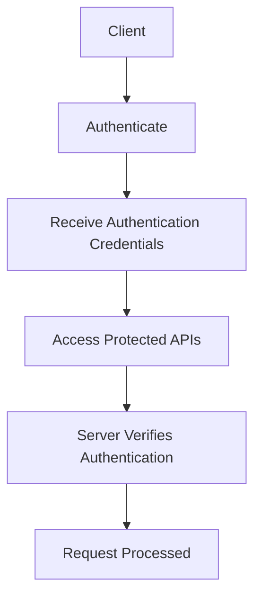

# 04-API-Specification.md

# 1. Purpose

This document defines the public REST API contract for the AgriSmart backend.

It specifies how client applications communicate with the system by describing endpoint behavior, request and response structures, authentication requirements, error handling conventions, and versioning strategy.

The objective is to provide a stable, consistent, and implementation-independent API contract for frontend applications and future integrations.

# 2. API Design Principles

The AgriSmart API follows these principles:

## AP-001 Resource-Oriented Design

Endpoints shall represent business resources rather than implementation details.

---

## AP-002 Consistency

Similar operations shall follow consistent naming, request formats, and response structures.

---

## AP-003 Statelessness

Each request shall contain all information required for processing.

---

## AP-004 Security

Protected resources shall require authentication before access.

---

## AP-005 Predictability

Successful and failed operations shall follow standardized response formats.

---

## AP-006 Backward Compatibility

Breaking API changes shall be introduced through versioning rather than modifying existing contracts.

---

## AP-007 Clear Responsibilities

Controllers expose the API contract, while business logic remains inside the service layer.

# 3. General Conventions

## 3.1 Base URL

All API endpoints are exposed under a versioned base path.

Example:

```text
/api/v1
```

## 3.2 Content Type

Request and response bodies shall use JSON unless otherwise specified.

File upload endpoints may use multipart form data.

## 3.3 Time Format

All timestamps shall use the ISO 8601 standard in UTC unless otherwise documented.

## 3.4 Naming Conventions

The API follows these naming conventions:

- Resource names use plural nouns.
- Endpoint paths use lowercase letters.
- Words are separated with hyphens.
- Query parameters use camelCase where appropriate.

Examples:
- `/users`
- `/crop-recommendations`
- `/disease-reports`
- `/ai/conversations`

## 3.5 Pagination

Endpoints returning collections should support pagination where appropriate.

Pagination behavior includes:

- Page number
- Page size
- Total records
- Total pages

## 3.6 Filtering

Collection endpoints may support filtering based on business requirements.

Examples include:

- Status
- Date range
- Processing state

## 3.7 Sorting

Collection endpoints may support sorting.

The default ordering should prioritize the most recently created or updated resources unless otherwise specified.

# 4. Authentication

## 4.1 Purpose

This section defines how clients authenticate with the AgriSmart API and how protected resources are accessed.

The authentication mechanism provides a consistent security model while remaining independent of implementation technology.

## 4.2 Authentication Principles

The API follows these authentication principles:

- Public endpoints shall be accessible without authentication.
- Protected endpoints shall require successful authentication.
- Authentication shall be verified before authorization.
- Authentication failures shall return standardized error responses.
- Authentication credentials shall be transmitted securely.

## 4.3 Public Endpoints

The following categories of endpoints are publicly accessible:

- User registration
- User login
- Email verification
- Password recovery
- Health check endpoints

## 4.4 Protected Endpoints

The following categories of endpoints require authentication:

- User profile management
- Dashboard
- Crop recommendations
- Disease reports
- AI assistant
- Administrative operations

## 4.5 Authentication Flow



## 4.6 Authorization

Authorization determines whether an authenticated user has permission to perform a requested operation.

The API shall enforce authorization according to user roles and business rules.

Administrative endpoints shall require elevated permissions.

## 4.7 Authentication Header

Protected requests shall include authentication credentials in the HTTP Authorization header.

Example:

```http
Authorization: <authentication credentials>
```

## 4.8 Authentication Errors

Authentication-related failures shall return standardized error responses.

Examples include:

- Missing authentication credentials
- Invalid authentication credentials
- Expired authentication credentials
- Insufficient permissions

## 4.9 Session Management

Authenticated access shall remain valid according to the configured session policy.

Session expiration, renewal, and revocation shall follow the authentication strategy defined by the implementation.

## 4.10 Future Authentication Enhancements

Potential future enhancements include:

- Multi-factor authentication
- Social authentication providers
- Device management
- Single Sign-On (SSO)
- Biometric authentication
- Fine-grained permission management

## 4.11 Endpoint Authentication Matrix

| Module | Authentication Required |
|---------|-------------------------|
| Authentication | No (except change password, logout) |
| User Profile | Yes |
| Dashboard | Yes |
| Crop Recommendation | Yes |
| Disease Detection | Yes |
| AI Assistant | Yes |
| Admin | Yes (Administrator only) |

# 5. Standard Request & Response Format

## 5.1 Purpose

This section defines the standard structure for API requests and responses.

A consistent contract simplifies client integration, improves maintainability, and provides predictable behavior across all API endpoints.

## 5.2 Request Principles

API requests shall follow these principles:

- Request bodies shall contain only data required by the operation.
- Resource identifiers shall be supplied through path parameters where appropriate.
- Filtering, pagination, and sorting shall use query parameters.
- Authentication credentials shall be supplied through request headers.
- File uploads shall use multipart form data when required.

## 5.3 Standard Success Response

Successful API operations shall return the following structure:

| Field | Purpose |
|--------|---------|
| success | Indicates whether the request succeeded |
| message | Human-readable summary of the operation |
| data | Business data returned by the operation |
| meta | Optional metadata such as pagination information |

## 5.4 Standard Error Response

Failed API operations shall return the following structure:

| Field | Purpose |
|--------|---------|
| success | Indicates the request failed |
| message | Human-readable error summary |
| errors | Detailed validation or business errors where applicable |
| traceId | Optional identifier used for troubleshooting and log correlation |

## 5.5 Pagination Response

Endpoints returning collections should include pagination metadata.

Typical metadata includes:

- Current page
- Page size
- Total records
- Total pages

## 5.6 Validation Errors

Validation failures shall clearly identify invalid input.

Validation error information may include:

- Field name
- Validation message
- Error code (optional)

## 5.7 Business Errors

Business rule violations shall return meaningful error messages while avoiding exposure of internal implementation details.

Business errors should help API consumers understand why the requested operation could not be completed.

## 5.8 Empty Responses

Operations that do not return business data shall still follow the standard response format.

The data field may be empty where appropriate.

## 5.9 File Upload Responses

Endpoints accepting file uploads shall return standardized responses indicating upload status and any associated business resources created during processing.

## 5.10 Response Consistency Rules

All API endpoints shall:

- Use the standard response structure.
- Return meaningful status messages.
- Return appropriate HTTP status codes.
- Avoid exposing internal implementation details.
- Preserve backward compatibility for response contracts.

## 5.11 HTTP Status Code Policy

The API shall use HTTP status codes consistently.

Typical mappings include:

| Status Code | Usage |
|-------------|-------|
| 200 OK | Successful retrieval or update |
| 201 Created | Resource successfully created |
| 204 No Content | Successful operation with no response body |
| 400 Bad Request | Invalid request format or validation failure |
| 401 Unauthorized | Authentication required or failed |
| 403 Forbidden | Authenticated but insufficient permissions |
| 404 Not Found | Requested resource does not exist |
| 409 Conflict | Business conflict (for example, duplicate email) |
| 422 Unprocessable Entity | Request is well-formed but violates business rules (optional, depending on team convention) |
| 429 Too Many Requests | Rate limit exceeded |
| 500 Internal Server Error | Unexpected server-side failure |

# 6. API Endpoints

## 6.1 Authentication

### Purpose

The Authentication API manages user identity and account access.

It provides operations for account registration, authentication, account recovery, email verification, and session management.

### Endpoints

| Method | Endpoint | Description | Authentication Required |
|----------|----------------------------|--------------------------------|-------------------------|
| POST | /auth/register | Register a new account | No |
| POST | /auth/login | Authenticate a user | No |
| POST | /auth/logout | End the current session | Yes |
| POST | /auth/refresh-token | Refresh authentication credentials | Yes |
| POST | /auth/forgot-password | Request password reset | No |
| POST | /auth/reset-password | Reset account password | No |
| POST | /auth/change-password | Change account password | Yes |
| POST | /auth/verify-email | Verify email address | No |
| POST | /auth/resend-verification | Resend verification email | No |
| GET | /auth/me | Retrieve authenticated user information | Yes |

### Business Rules

- Email addresses shall be unique.
- Email verification is required before accessing protected features.
- Password changes require an authenticated user.
- Password reset requires successful account verification.
- Authentication failures shall not expose sensitive account information.

### Future Endpoints

- Social authentication
- Multi-factor authentication
- Device management
- Session history

## 6.2 User Profile

### Purpose

The User Profile API manages farmer profile information and farm-related details.

### Endpoints

| Method | Endpoint | Description | Authentication Required |
|----------|-------------------------|------------------------------|-------------------------|
| GET | /profile | Retrieve current profile | Yes |
| PATCH | /profile | Update profile information | Yes |
| POST | /profile/avatar | Upload profile image | Yes |
| DELETE | /profile/avatar | Remove profile image | Yes |

### Business Rules

- Every user owns exactly one profile.
- Users may update only their own profile.
- Profile updates shall be validated before persistence.

## 6.3 Dashboard

### Purpose

The Dashboard API provides summarized information required by the AgriSmart dashboard.

### Endpoints

| Method | Endpoint | Description | Authentication Required |
|----------|---------------------|---------------------------|-------------------------|
| GET | /dashboard | Retrieve dashboard summary | Yes |

### Business Rules

- Dashboard data shall contain only information owned by the authenticated user.
- Dashboard responses should prioritize recent activity.

## 6.4 Crop Recommendation

### Purpose

The Crop Recommendation API manages crop recommendation requests and historical recommendation records.

### Endpoints

| Method | Endpoint | Description | Authentication Required |
|----------|-------------------------------|-------------------------------------|-------------------------|
| POST | /crop-recommendations | Request a new recommendation | Yes |
| GET | /crop-recommendations | Retrieve recommendation history | Yes |
| GET | /crop-recommendations/{id} | Retrieve recommendation details | Yes |
| DELETE | /crop-recommendations/{id} | Remove recommendation history (optional policy) | Yes |

### Business Rules

- Recommendations belong to the authenticated user.
- Recommendation history shall remain accessible.
- Recommendation requests shall be validated before processing.

## 6.5 Disease Detection

### Purpose

The Disease Detection API manages crop image analysis and disease diagnosis history.

### Endpoints

| Method | Endpoint | Description | Authentication Required |
|----------|-----------------------------|------------------------------------|-------------------------|
| POST | /disease-reports | Submit crop image for analysis | Yes |
| GET | /disease-reports | Retrieve report history | Yes |
| GET | /disease-reports/{id} | Retrieve report details | Yes |
| DELETE | /disease-reports/{id} | Remove report history (optional policy) | Yes |

### Business Rules

- Reports belong to the authenticated user.
- Uploaded images shall be validated.
- Reports shall preserve diagnosis history.

## 6.6 AI Assistant

### Purpose

The AI Assistant API manages conversations and messages exchanged with the AgriSmart AI assistant.

### Endpoints

| Method | Endpoint | Description | Authentication Required |
|----------|--------------------------------------|-------------------------------------|-------------------------|
| POST | /conversations | Start a conversation | Yes |
| GET | /conversations | Retrieve conversations | Yes |
| GET | /conversations/{id} | Retrieve conversation details | Yes |
| POST | /conversations/{id}/messages | Send a new message | Yes |
| GET | /conversations/{id}/messages | Retrieve conversation messages | Yes |
| DELETE | /conversations/{id} | Archive/Delete conversation | Yes |

### Business Rules

- Conversations belong to the authenticated user.
- Messages belong to exactly one conversation.
- Messages shall remain ordered chronologically.

## 6.7 Admin

### Purpose

The Admin API provides operational capabilities for managing the AgriSmart platform.

### Endpoints

| Method | Endpoint | Description | Authentication Required |
|----------|------------------------------|-----------------------------|-------------------------|
| GET | /admin/users | Retrieve user list | Yes (Admin) |
| GET | /admin/users/{id} | Retrieve user details | Yes (Admin) |
| PATCH | /admin/users/{id}/status | Update user status | Yes (Admin) |
| GET | /admin/dashboard | Retrieve platform metrics | Yes (Admin) |
| GET | /admin/reports | Retrieve operational reports | Yes (Admin) |

### Business Rules

- Administrative endpoints require administrator privileges.
- Administrative operations shall be audited.
- Administrators shall not bypass business validation rules.

# 7. Error Handling

## 7.1 Purpose

This section defines the standard approach for reporting API errors.

The objective is to provide consistent, meaningful, and secure error responses while preventing exposure of internal implementation details.

## 7.2 Error Handling Principles

The API follows these error handling principles:

- Every failed request shall return a standardized error response.
- Error messages shall be understandable by API consumers.
- Internal implementation details shall never be exposed.
- Validation errors shall clearly identify invalid input.
- Unexpected failures shall be logged for operational investigation.

## 7.3 Error Categories

The API distinguishes the following categories of errors:

| Category | Description |
|----------|-------------|
| Validation Error | Invalid client input |
| Authentication Error | Missing or invalid authentication |
| Authorization Error | Insufficient permissions |
| Resource Error | Requested resource not found |
| Business Rule Error | Operation violates business rules |
| Rate Limit Error | Request limit exceeded |
| Internal Server Error | Unexpected server-side failure |

## 7.4 Error Response Principles

Error responses shall:

- Use the standard response format.
- Include a human-readable message.
- Provide field-level validation details where applicable.
- Include a trace identifier when available.
- Avoid revealing internal stack traces or infrastructure details.

## 7.5 Logging & Monitoring

Operational errors shall be logged to support:

- Troubleshooting
- Monitoring
- Incident response
- Performance analysis

Logging practices are implementation-specific and are defined within the system architecture.

# 8. Versioning Strategy

## 8.1 Purpose

API versioning enables the AgriSmart platform to introduce new capabilities while maintaining compatibility for existing clients.

## 8.2 Versioning Principles

The API follows these principles:

- Public APIs shall be versioned.
- Breaking changes require a new major version.
- Non-breaking enhancements may be introduced within the current version.
- Deprecated endpoints shall remain available for a defined transition period.

## 8.3 Version Format

API versions shall be included within the base URL.

Example:

```text
/api/v1
```

## 8.4 Deprecation Policy

Deprecated endpoints shall:

- Be clearly documented.
- Continue functioning during the deprecation period.
- Provide migration guidance where applicable.
- Be removed only after the defined lifecycle has ended.

## 8.5 Compatibility

Backward compatibility should be preserved whenever practical.

Breaking changes shall be minimized and communicated through version updates.

# 9. Rate Limiting

## 9.1 Purpose

Rate limiting protects the AgriSmart platform from excessive or abusive request volumes while ensuring fair resource usage for all clients.

## 9.2 Rate Limiting Principles

The API follows these principles:

- Public endpoints may have different limits than authenticated endpoints.
- Administrative endpoints may use stricter policies.
- AI-intensive operations may have additional protection.
- Rate limiting shall be applied consistently across supported clients.

## 9.3 Protected Operations

Operations that may require stricter limits include:

- User login
- Password recovery
- Email verification
- Crop recommendation requests
- Disease analysis requests
- AI assistant interactions

## 9.4 Client Behavior

When rate limits are exceeded:

- The request shall be rejected.
- A standardized error response shall be returned.
- Clients should retry according to the provided guidance.

## 9.5 Future Enhancements

Future improvements may include:

- User-based quotas
- Tiered API limits
- Adaptive rate limiting
- AI workload prioritization

# 10. Future API Evolution

## 10.1 Purpose

This section outlines potential future enhancements to the AgriSmart API while preserving the current architectural direction.

## 10.2 Planned Enhancements

Potential future capabilities include:

- Weather service integration
- Farm management APIs
- Notification APIs
- Crop history APIs
- Image management APIs
- AI feedback APIs
- Reporting and analytics APIs

## 10.3 Integration Opportunities

Future integrations may include:

- Government agricultural services
- IoT sensor platforms
- Satellite imagery providers
- Third-party weather providers
- Mobile push notification services

## 10.4 Evolution Principles

Future API development should:

- Preserve consistency with existing design principles.
- Minimize breaking changes.
- Maintain backward compatibility where practical.
- Follow the established authentication and response conventions.
- Introduce new capabilities through modular expansion.