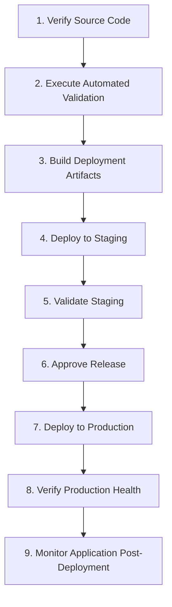
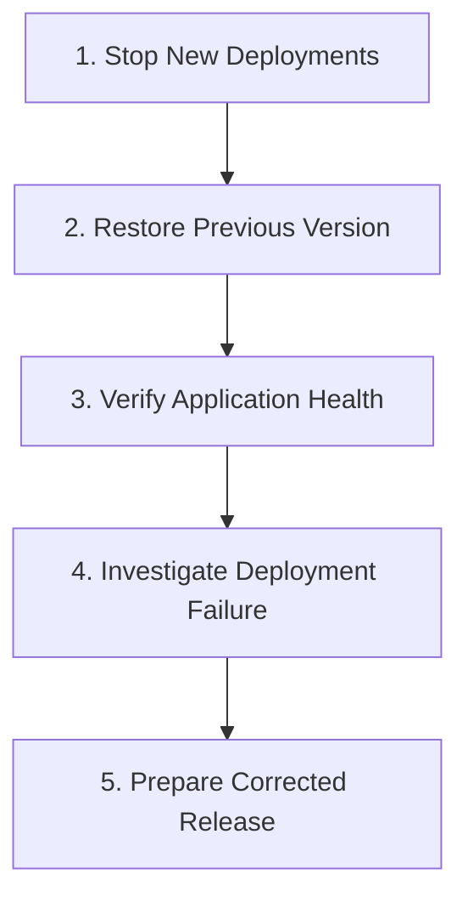

# 08-Deployment.md

# 1. Purpose

This document defines the deployment strategy for the AgriSmart backend.

It describes the deployment environments, infrastructure requirements, release process, runtime configuration, operational considerations, and recovery procedures.

The objective is to ensure reliable, repeatable, and secure deployments throughout the project lifecycle.

# 2. Deployment Strategy

The AgriSmart backend shall be deployed using a containerized deployment model to ensure consistency across development, staging, and production environments.

Deployment should be automated where practical to reduce manual errors and improve release reliability.

Core principles include:

- Repeatable deployments
- Environment consistency
- Zero manual configuration where possible
- Rollback capability
- Minimal downtime

# 3. Environments

The project supports multiple deployment environments.

## 3.1 Development

### Purpose

- Local development
- Feature implementation
- Debugging

### Characteristics

- Local database
- Development secrets
- Debug logging enabled

---

## 3.2 Staging

### Purpose

- Integration testing
- User acceptance testing
- Production verification

### Characteristics

- Mirrors production configuration
- Separate database
- Restricted access

---

## 3.3 Production

### Purpose

- Live application

### Characteristics

- Production database
- Optimized logging
- Monitoring enabled
- Secure secrets management

# 4. Infrastructure

The deployment infrastructure consists of:

- Backend Application
- MongoDB Database
- Image Storage Provider
- AI Service Provider
- Reverse Proxy
- HTTPS Termination
- Monitoring Platform
- Logging Platform

Infrastructure components should remain loosely coupled to support future replacement or scaling.

# 5. Prerequisites

Before deployment, the following prerequisites must be satisfied.

## 5.1 Infrastructure

- Server or cloud environment available
- Database available
- HTTPS configured
- Domain configured

## 5.2 Application

- Environment variables configured
- Dependencies installed
- Build completed successfully

## 5.3 Security

- Secrets configured
- API keys configured
- Database credentials configured

# 6. Build Process

The deployment build process consists of:

1. Install project dependencies.
2. Execute static analysis.
3. Execute automated tests.
4. Build the TypeScript project.
5. Generate deployment artifacts.
6. Build application container.
7. Publish deployment artifact.

# 7. Release Process

Every release should follow a controlled process.

Release workflow:

1. Verify source code.
2. Execute automated validation.
3. Build deployment artifacts.
4. Deploy to staging.
5. Validate staging.
6. Approve release.
7. Deploy to production.
8. Verify production health.
9. Monitor application after deployment.

# 8. Runtime Configuration

Runtime configuration shall be provided through environment variables.

Configuration categories include:

- Server configuration
- Database configuration
- Authentication configuration
- AI provider configuration
- File storage configuration
- Logging configuration
- Security configuration

Application configuration should never be hardcoded.

# 9. Monitoring & Logging

Production deployments should provide operational visibility through monitoring and structured logging.

Monitoring should include:

- Application availability
- Error rates
- Response times
- Database connectivity
- External service availability

Logging should support:

- Operational debugging
- Security auditing
- Incident investigation

# 10. Backup & Recovery

Database backups should be performed regularly.

Recovery procedures should support:

- Database restoration
- Configuration recovery
- Disaster recovery

Backup integrity should be verified periodically.

# 11. Rollback Strategy

Deployments should support rollback when critical issues are identified.

Rollback may be initiated when:

- Critical production defects occur.
- Security vulnerabilities are discovered.
- Deployment validation fails.
- Service availability is significantly degraded.

Rollback procedure:

1. Stop new deployments.
2. Restore previous application version.
3. Verify application health.
4. Investigate deployment failure.
5. Prepare corrected release.

# 12. Deployment Checklist

Before deployment, verify:

## 12.1 Code Quality

- All tests pass.
- Static analysis completed.
- Documentation updated.

## 12.2 Security

- Secrets configured.
- HTTPS enabled.
- Environment variables verified.

## 12.3 Infrastructure

- Database available.
- External services reachable.
- Monitoring operational.

## 12.4 Deployment

- Build successful.
- Deployment artifacts generated.
- Rollback strategy available.

## 12.5 Post Deployment

- Health checks successful.
- Logs reviewed.
- Monitoring verified.
- Critical workflows validated.